# watus_jetson — Wielomodułowy System Percepcji i Interakcji AI

## Spis Treści

1. [Wprowadzenie](#wprowadzenie)
2. [Architektura Systemu](#architektura-systemu)
3. [Wymagania Systemowe](#wymagania-systemowe)
4. [Instalacja Bibliotek](#instalacja-bibliotek)
5. [Pobieranie Modeli](#pobieranie-modeli)
6. [Struktura Projektu](#struktura-projektu)
7. [Szczegółowy Opis Komponentów](#szczegółowy-opis-komponentów)
   - [Warstwa Wizji](#warstwa-wizji)
   - [Warstwa Audio](#warstwa-audio)
   - [Warstwa LLM](#warstwa-llm)
   - [Consolidator](#consolidator)
   - [LiDAR](#lidar)
8. [Konfiguracja](#konfiguracja)
9. [Uruchamianie Systemu](#uruchamianie-systemu)
10. [Rozwiązywanie Problemów](#rozwiązywanie-problemów)
11. [Diagramy Przepływu Danych](#diagramy-przepływu-danych)
12. [Topologia Komunikacji](#topologia-komunikacji)
13. [Podsumowanie](#podsumowanie)

---

> [!IMPORTANT]
> **Status Implementacji (v1.x vs v2.0)**
> Niniejsza dokumentacja opisuje **docelową architekturę v2.0** opartą w pełni na szynie danych ZeroMQ. Obecna wersja kodu (v1.x) znajduje się w fazie przejściowej i działa w trybie **hybrydowym**:
>
> - **Warstwa Audio:** Wykorzystuje ZMQ + HTTP.
> - **Warstwa Wizji i LiDAR:** Wykorzystują głównie pliki JSON (`camera.jsonl`, `lidar.json`) do wymiany danych.
> - **Consolidator:** Obecnie odczytuje pliki, trwają prace nad migracją na pełne ZMQ (patrz: `system_improvement_plan.md`).
>
> Proszę sugerować się kodem źródłowym w kwestiach konfiguracji portów i parametrów, które mogą nie być jeszcze w pełni zaimplementowane.

## Wprowadzenie

Watus_jetson to zaawansowany, wielomodułowy system sztucznej inteligencji zaprojektowany z myślą o platformach wbudowanych, w szczególności urządzeniach z rodziny NVIDIA Jetson. System integruje w sobie cztery kluczowe domeny percepcji maszynowej: przetwarzanie obrazu w czasie rzeczywistym, analizę i syntezę mowy, interpretację danych z czujników LiDAR oraz zaawansowane wnioskowanie językowe wspierane przez modele dużych języków (LLM). Całość architektury opiera się na asynchronicznej komunikacji międzyprocesowej realizowanej poprzez bibliotekę ZeroMQ (ZMQ), co zapewnia wysoką wydajność i skalowalność poszczególnych komponentów.

Projekt watus_jetson został stworzony z myślą o zastosowaniach robotycznych, gdzie niezbędna jest szybka i precyzyjna interpretacja otoczenia. System potrafi w czasie rzeczywistym analizować obraz z kamer, rozpoznawać obiekty i ich lokalizację, przetwarzać komendy głosowe użytkownika, identyfikować mówcę na podstawie charakterystyki głosu oraz generować naturalne odpowiedzi syntetycznej mowy. Dane ze wszystkich źródeł sensorycznych są agregowane przez moduł consolidator, który synchronizuje je czasowo i przekazuje do warstwy LLM odpowiedzialnej za podejmowanie decyzji oraz generowanie kontekstowych odpowiedzi.

Głównym założeniem projektowym jest modularność i niezależność poszczególnych warstw. Każdy komponent działa jako samodzielny proces, komunikując się z pozostałymi poprzez zdefiniowane interfejsy komunikacyjne. Takie podejście umożliwia niezależne testowanie, debugowanie oraz rozwijanie poszczególnych części systemu bez konieczności modyfikacji pozostałych modułów. Dodatkowo, architektura pozwala na elastyczne dostosowywanie konfiguracji sprzętowej — poszczególne warstwy mogą być uruchamiane na różnych urządzeniach w sieci, tworząc rozproszony system przetwarzania.

---

## Architektura Systemu

### Przegląd Ogólny

Architektura systemu watus_jetson opiera się na wzorcu publikuj-subskrybuj (publish-subscribe), gdzie ZeroMQ pełni rolę centralnej szyny danych łączącej wszystkie komponenty systemu. Każda z warstw percepcyjnych (wizja, audio, LiDAR) działa jako niezależny wydawca (publisher), publikując przetworzone dane na dedykowanych gniazdach sieciowych. Moduł consolidator pełni rolę subskrybenta (subscriber), agregując dane ze wszystkich źródeł i przygotowując je do dalszego przetwarzania przez warstwę LLM. Taki model komunikacji zapewnia luźne powiązanie między komponentami, wysoką przepustowość danych oraz możliwość łatwego dodawania nowych źródeł danych bez konieczności modyfikacji istniejącego kodu.

Warstwa LLM, zbudowana w oparciu o framework FastAPI, obsługuje zewnętrzne zapytania poprzez interfejs REST API. Komunikuje się zarówno z consolidatorem (odbierając zagregowane dane sensoryczne), jak i z bazą wektorową ChromaDB, która przechowuje historię konwersacji i umożliwia implementację mechanizmu Retrieval-Augmented Generation (RAG). Dzięki RAG system potrafi wykorzystać kontekst wcześniejszych rozmów oraz zewnętrzną wiedzę bazową do generowania bardziej trafnych i spersonalizowanych odpowiedzi.

### Diagram Architektury Systemu

Poniższy diagram przedstawia ogólną architekturę systemu oraz przepływ danych między poszczególnymi komponentami:

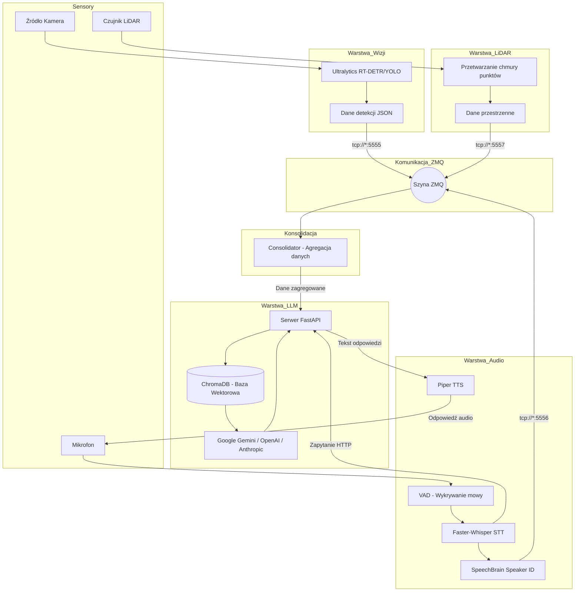

### Przepływ Danych w Warstwie Audio

Poniższy diagram sekwencyjny przedstawia szczegółowy przepływ danych podczas przetwarzania komendy głosowej użytkownika:

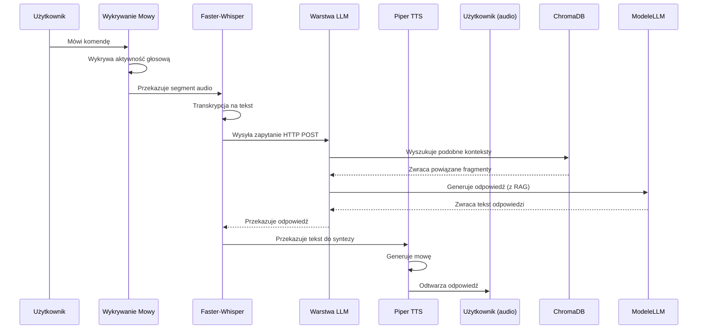

### Schemat Komunikacji Międzyprocesowej

System wykorzystuje następujące porty i wzorce komunikacji ZMQ:


| Komponent     | Rola           | Port      | Typ Gniazda |
| ------------- | -------------- | --------- | ----------- |
| Warstwa Wizji | Publisher      | 5555      | PUB         |
| Warstwa Audio | Publisher      | 5556      | PUB         |
| Warstwa LiDAR | Publisher      | 5557      | PUB         |
| Consolidator  | Subscriber     | 5555-5557 | SUB         |
| Warstwa Audio | Subscriber TTS | 7781      | SUB         |
| Warstwa Audio | Publisher      | 7780      | PUB         |

Każdy publisher wysyła wiadomości w formacie JSON zawierającym znacznik czasowy, dane sensoryczne oraz metadane. Subscriberzy filtrują wiadomości na podstawie zdefiniowanych filtrów tematów, co pozwala na selektywne odbieranie tylko interesujących ich typów danych. Format wiadomości jest ściśle określony i walidowany, co zapewnia spójność danych przesyłanych między komponentami.

---

## Wymagania Systemowe

### Wymagania Sprzętowe

System watus_jetson został zaprojektowany z myślą o platformach embedded z procesorami graficznymi NVIDIA, jednak może być również uruchamiany na standardowych komputerach PC wyposażonych w karty graficzne z architekturą CUDA. Poniżej przedstawiono minimalne oraz zalecane parametry sprzętowe dla poszczególnych scenariuszy wdrożeniowych.

W przypadku urządzeń z rodziny NVIDIA Jetson, system jest w pełni kompatybilny z modelami Jetson Nano, Jetson TX2, Jetson Xavier NX oraz najnowszymi wersjami Jetson Orin. Urządzenia te oferują zbalansowaną wydajność energetyczną, co czyni je idealnym wyborem dla aplikacji robotycznych wymagających przetwarzania w czasie rzeczywistym. Jetson Nano zapewnia wystarczającą moc obliczeniową dla podstawowych scenariuszy wykorzystujących mniejsze modele detekcji obiektów, podczas gdy Jetson Orin radzi sobie bez problemu z równoczesnym przetwarzaniem wielu strumieni danych sensorycznych.

Dla wdrożeń na standardowych stacjach roboczych wymagana jest karta graficzna z obsługą CUDA w wersji 11.8 lub wyższej, minimum 4 GB pamięci VRAM dla podstawowych modeli, 8 GB pamięci RAM systemowej oraz procesor wielordzeniowy zdolny do obsługi wielu wątków przetwarzania. Zalecane są karty z serii NVIDIA GeForce RTX 20xx lub nowsze, ewentualnie profesjonalne karty z serii NVIDIA Tesla lub Quadro dla zastosowań przemysłowych.

### Wymagania Systemowe Operacyjne

System został przetestowany i jest w pełni funkcjonalny na systemach operacyjnych Linux opartych na dystrybucji Debian lub Red Hat. Rekomendowanym środowiskiem jest Ubuntu 20.04 LTS lub Ubuntu 22.04 LTS, które oferują najlepszą kompatybilność ze sterownikami NVIDIA CUDA oraz bibliotekami systemowymi wymaganymi przez poszczególne komponenty. System może być również uruchamiany na macOS (z ograniczeniami dla komponentów wymagających CUDA) oraz Windows WSL2, choć te konfiguracje nie są oficjalnie wspierane i mogą wymagać dodatkowych dostosowań.

Przed przystąpieniem do instalacji należy upewnić się, że na systemie są zainstalowane najnowsze sterowniki NVIDIA oraz toolkit CUDA. Weryfikację poprawnej instalacji można przeprowadzić poprzez wykonanie polecenia `nvidia-smi`, które powinno wyświetlić informacje o zainstalowanym sterowniku, wersji CUDA oraz dostępnej pamięci GPU. W przypadku urządzeń Jetson, sterowniki są dostarczane wraz z obrazem systemu JetPack i nie wymagają osobnej instalacji.

### Zależności Systemowe

Poniżej przedstawiono listę wymaganych pakietów systemowych wraz z poleceniami instalacji dla najpopularniejszych dystrybucji:

**Ubuntu/Debian:**

```bash
sudo apt-get update
sudo apt-get install -y libsndfile1 portaudio19-dev libasound2-dev espeak-ng ffmpeg python3-pip python3-venv git cmake
```

**Fedora/RHEL:**

```bash
sudo dnf install -y libsndfile portaudio-devel alsa-lib espeak-ng ffmpeg python3-pip python3-venv git cmake
```

**macOS (Homebrew):**

```bash
brew install portaudio libsndfile espeak-ng ffmpeg python@3.11
```

Biblioteka `libsndfile` jest wymagana przez moduł przetwarzania audio do efektywnego operowania na plikach dźwiękowych różnych formatów. PortAudio umożliwia komunikację z urządzeniami audio wejściowymi i wyjściowymi, zapewniając niskolatencyjne przechwytywanie oraz odtwarzanie dźwięku. Espeak-ng dostarcza syntezator mowy fallback oraz wspomaga pracę Piper TTS w zakresie przetwarzania fonemów. Ffmpeg jest niezbędny do konwersji i przetwarzania strumieni wideo oraz audio.

---

## Instalacja Bibliotek

### Tworzenie Środowiska Wirtualnego

Zalecanym podejściem jest utworzenie izolowanego środowiska wirtualnego Python, które zapewni separację zależności projektu od globalnej instalacji Pythona oraz umożliwi łatwe zarządzanie wersjami bibliotek. Poniżej przedstawiono instrukcję tworzenia i aktywacji środowiska wirtualnego:

```bash
cd ścieżka/do/watus_jetson
python3 -m venv watus_env
source watus_env/bin/activate
```

Po aktywacji środowiska wirtualnego wszystkie instalacje pakietów Python będą dotyczyły tylko tego środowiska. Aby opuścić środowisko wirtualne, należy wykonać polecenie `deactivate`. W przypadku pracy na urządzeniach Jetson, gdzie zasoby pamięciowe są ograniczone, zaleca się użycie środowiska Conda zamiast standardowego venv, ponieważ oferuje ono lepszą kompresję pakietów oraz bardziej efektywne zarządzanie zależnościami.

### Instalacja Głównych Zależności

Instalacja bibliotek Python wymaganych przez system odbywa się poprzez menedżer pip z plików requirements.txt znajdujących się w poszczególnych katalogach projektu. Ze względu na specyfikę poszczególnych komponentów, każda warstwa posiada własny plik zależności, co pozwala na instalację tylko niezbędnych pakietów dla danego modułu.

**Instalacja wszystkich zależności:**

```bash
find . -name "requirements.txt" -exec pip install -r {} \;
```

**Instalacja zależności dla warstwy wizji:**

```bash
cd warstwa_wizji
pip install -r requirements.txt
```

**Instalacja zależności dla warstwy audio:**

```bash
cd warstwa_audio
pip install -r requirements.txt
```

**Instalacja zależności dla warstwy LLM:**

```bash
cd warstwa_llm
pip install -r requirements.txt
```

### Instalacja PyTorch z Obsługą CUDA

PyTorch w wersji dla architektury CUDA wymaga osobnej instalacji i musi być dopasowany do wersji sterowników CUDA zainstalowanych w systemie. System watus_jetson jest kompatybilny z PyTorch 2.6 oraz CUDA 12.4. Poniżej przedstawiono polecenie instalacji odpowiedniej wersji:

```bash
pip install --index-url https://download.pytorch.org/whl/cu124 torch==2.6.* torchvision==0.21.* torchaudio==2.6.*
```

Weryfikację poprawnej instalacji PyTorch z obsługą CUDA można przeprowadzić poprzez wykonanie poniższego skryptu testowego:

```python
import torch
print(f"Wersja PyTorch: {torch.__version__}")
print(f"CUDA dostępna: {torch.cuda.is_available()}")
print(f"Wersja CUDA: {torch.version.cuda}")
print(f"Liczba GPU: {torch.cuda.device_count()}")
```

Jeśli instalacja przebiegła poprawnie, wynik powinien potwierdzać dostępność CUDA oraz wyświetlać informacje o zainstalowanej wersji. W przypadku urządzeń Jetson z JetPack 5 lub 6, należy użyć dedykowanych pakietów PyTorch dostępnych w repozytorium NVIDIA NGC, które są zoptymalizowane pod architekturę ARM oraz procesory graficzne Jetson.

### Dodatkowe Biblioteki Specjalistyczne

Poniżej przedstawiono listę kluczowych bibliotek wraz z ich przeznaczeniem w systemie:


| Biblioteka     | Wersja | Przeznaczenie                   |
| -------------- | ------ | ------------------------------- |
| ultralytics    | 8.0+   | Detekcja obiektów YOLO/RT-DETR |
| faster-whisper | 1.0+   | Rozpoznawanie mowy (STT)        |
| piper-tts      | 1.2+   | Synteza mowy (TTS)              |
| speechbrain    | 1.0+   | Identyfikacja mówcy            |
| chromadb       | 0.5+   | Baza wektorowa dla RAG          |
| fastapi        | 0.100+ | Serwer REST API                 |
| pydantic       | 2.0+   | Walidacja danych                |
| pyzmq          | 25.0+  | Komunikacja międzyprocesowa    |
| onnxruntime    | 1.15+  | Inferencja modeli ONNX          |

---

## Pobieranie Modeli

System watus_jetson wykorzystuje wiele specjalistycznych modeli uczenia maszynowego, które muszą być pobrane i skonfigurowane przed pierwszym uruchomieniem. Poniżej przedstawiono szczegółowe instrukcje dotyczące pobierania modeli dla poszczególnych komponentów systemu.

### Modele Detekcji Obiektów (Warstwa Wizji)

Warstwa wizji wykorzystuje modele z biblioteki Ultralytics, wspierające zarówno architekturę YOLO (You Only Look Once) jak i RT-DETR (Real-Time Detection Transformer). Modele te są automatycznie pobierane przy pierwszym uruchomieniu, jednak dla zastosowań produkcyjnych zaleca się ręczne pobranie i skonfigurowanie odpowiedniej wersji modelu.

**Zalecane modele dla urządzeń Jetson:**


| Model     | Rozmiar | FPS (Jetson Orin) | Zastosowanie                           |
| --------- | ------- | ----------------- | -------------------------------------- |
| YOLOv8n   | 6.2 MB  | 30+               | Szybka detekcja, niskie zasoby         |
| YOLOv8s   | 11.2 MB | 25+               | Równowaga wydajności/dokładności   |
| RT-DETR-s | 20 MB   | 20+               | Wyższa dokładność, większe zasoby |

Automatyczne pobranie domyślnego modelu następuje przy pierwszym uruchomieniu skryptu `main.py` z katalogu `warstwa_wizji`:

```python
from ultralytics import YOLO
model = YOLO('yolo12s.pt')  # Pobiera model automatycznie (domyślny w projekcie)
```

Dla modeli RT-DETR należy użyć poniższej instrukcji:

```python
from ultralytics import RTDETR
model = RTDETR('rtdetr-l.pt')  # Model duży
# lub
model = RTDETR('rtdetr-s.pt')  # Model mały
```

### Modele Rozpoznawania Mowy (Faster-Whisper)

Faster-Whisper to zoptymalizowana implementacja modelu Whisper od OpenAI, wykorzystująca bibliotekę CTranslate2 do efektywnej inferencji na CPU oraz GPU. System wspiera różne warianty modelu, różniące się rozmiarem i dokładnością transkrypcji.

**Dostępne warianty modelu Whisper:**


| Model    | Parametry | Rozmiar | Wymagania VRAM |
| -------- | --------- | ------- | -------------- |
| tiny     | 39 M      | 75 MB   | ~1 GB          |
| base     | 74 M      | 142 MB  | ~1.5 GB        |
| small    | 244 M     | 484 MB  | ~2 GB          |
| medium   | 769 M     | 1.5 GB  | ~4 GB          |
| large-v3 | 1550 M    | 3 GB    | ~8 GB          |

Dla urządzeń Jetson Nano zaleca się użycie modelu `base` lub `small`, natomiast dla Jetson Orin można bez problemu używać modelu `medium`. Konfiguracja modelu odbywa się poprzez zmienną środowiskową `WHISPER_MODEL` lub bezpośrednio w kodzie:

```python
from faster_whisper import WhisperModel
model = WhisperModel("small", device="cuda", compute_type="float16")
```

### Modele Syntezy Mowy (Piper TTS)

Piper TTS to syntetyzator mowy oparty na sieciach neuronowych, oferujący naturalnie brzmiące głosy przy niskim zużyciu zasobów obliczeniowych. Modele Piper są dostępne w formacie ONNX i wymagają pobrania zarówno pliku modelu (`.onnx`) jak i pliku konfiguracyjnego (`.json`).

**Polskie modele Piper dostępne na Hugging Face:**


| Model                | Głos    | Rozmiar | Charakterystyka           |
| -------------------- | -------- | ------- | ------------------------- |
| pl_PL-darkman-medium | Darkman  | 80 MB   | Głos męski, naturalny   |
| pl_PL-agnessa-medium | Agnessa  | 80 MB   | Głos żeński, naturalny |
| pl_PL-mikol-medium   | Mikołaj | 80 MB   | Głos męski, dynamiczny  |

Pobieranie modelu Piper odbywa się poprzez skrypt konfiguracyjny lub ręcznie:

```bash
# Tworzenie katalogu na modele
mkdir -p models/piper
cd models/piper

# Pobieranie modelu (przykład dla darkman)
wget https://huggingface.co/rhasspy/piper-pl_PL-darkman-medium/resolve/main/pl_PL-darkman-medium.onnx
wget https://huggingface.co/rhasspy/piper-pl_PL-darkman-medium/resolve/main/pl_PL-darkman-medium.json
```

Konfiguracja ścieżki do modelu odbywa się poprzez zmienną środowiskową `PIPER_MODEL_PATH`:

```bash
export PIPER_MODEL_PATH="/ścieżka/do/models/piper/pl_PL-darkman-medium.onnx"
```

### Modele Identyfikacji Mówcy (SpeechBrain)

SpeechBrain oferuje zaawansowane modele weryfikacji i identyfikacji mówcy oparte na architekturze ECAPA-TDNN (Emphasized Channel Attention, Propagation and Aggregation in Time Delay Neural Network). Modele te przekształcają próbki głosu wektory osadzeniowe (embeddings), które następnie są porównywane w celu identyfikacji mówcy.

**Konfiguracja modelu Speaker ID:**

```python
import speechbrain as sb
from speechbrain.inference.speaker import EncoderClassifier

classifier = EncoderClassifier.from_hparams(
    source="speechbrain/spkrec-ecapa-voxceleb",
    savedir="models/speaker_ecapa"
)
```

Model jest automatycznie pobierany przy pierwszym uruchomieniu z repozytorium Hugging Face. Wymaga około 500 MB przestrzeni dyskowej oraz 2 GB pamięci RAM podczas inferencji.

### Modele Dużych Języków (LLM)

Warstwa LLM watus_jetson wspiera integrację z wieloma dostawcami modeli językowych poprzez dedykowane API. System nie wymaga pobierania modeli lokalnie — komunikuje się z zewnętrznymi serwisami API w celu generowania odpowiedzi. Jednakże, dla scenariuszy wymagających pełnej lokalizacji, możliwa jest konfiguracja lokalnych modeli poprzez serwer Ollama lub LM Studio.

**Obsługiwani dostawcy LLM:**


| Dostawca         | Modele                             | Wymagania      |
| ---------------- | ---------------------------------- | -------------- |
| Google Gemini    | gemini-2.5-flash, gemini-2.5-pro   | Klucz API      |
| OpenAI           | gpt-5, gpt-5.2                     | Klucz API      |
| Anthropic        | claude-3.5-sonet                   | Klucz API      |
| Ollama (lokalny) | llama3, mistral, qwen, gpt-oss-20b | Lokalny serwer |

Konfiguracja kluczy API odbywa się poprzez plik `.env`, który zostanie omówiony w sekcji dotyczącej konfiguracji systemu.

---

## Struktura Projektu

Poniżej przedstawiono pełną strukturę katalogów repozytorium watus_jetson wraz z opisem zawartości każdego pliku i katalogu:

```
watus_jetson/
├── .gitattributes          # Konfiguracja atrybutów Git
├── .gitignore              # Wzorce plików ignorowanych przez Git
├── consolidator/           # Moduł agregacji danych sensorycznych
│   ├── consolidator.py     # Główny skrypt consolidatora
│   └── consolidator.json   # Plik konfiguracyjny
├── lidar/                  # Moduł przetwarzania danych LiDAR
│   ├── src/                # Kod źródłowy
│   │   ├── config.py       # Konfiguracja systemu
│   │   ├── check_lidar.py  # Skrypt diagnostyczny
│   │   ├── Grid_vis.py     # Wizualizacja siatki zajętości
│   │   ├── Live_Vis_v3.py  # Wizualizacja na żywo (offline recording)
│   │   ├── run_live.py     # Główna pętla przetwarzania
│   │   ├── hardware/       # Sterowniki sprzętowe
│   │   │   └── lidar_driver.py
│   │   └── lidar/          # Logika biznesowa
│   │       ├── io.py             # Operacje wejścia/wyjścia (JSON)
│   │       ├── occupancy_grid.py # Mapa zajętości
│   │       ├── preprocess.py     # Przetwarzanie wstępne
│   │       ├── segmentation.py   # Segmentacja obiektów
│   │       ├── system.py         # Główna klasa systemu
│   │       ├── tracking.py       # Śledzenie (Human Tracking)
│   │       └── types.py          # Typy danych i definicje
│   ├── run.py              # Skrypt uruchomieniowy modułu LiDAR (legacy)
│   ├── run_vis.py          # Skrypt wizualizacji danych LiDAR (legacy)
│   └── requirements.txt    # Zależności modułu LiDAR
├── warstwa_audio/          # Moduł przetwarzania dźwięku
│   ├── run_watus.py        # Główny frontend audio (orchestrator)
│   ├── camera_runner.py    # Przetwarzanie obrazu dla kontekstu
│   ├── run_reporter.py     # Reporter ZMQ i interfejs LLM
│   ├── test_ollama.py      # Testy integracji z Ollama
│   ├── watus_audio/        # Podmoduł audio (szczegóły implementacji)
│   ├── requirements.txt    # Zależności modułu audio
│   └── README.md           # Dokumentacja modułu audio
├── warstwa_llm/            # Moduł warstwy językowej (LLM)
│   ├── src/                # Kod źródłowy
│   │   ├── logic/          # Logika biznesowa
│   │   │   ├── llm.py      # Obsługa modeli językowych
│   │   │   └── vectordb.py # Obsługa bazy wektorowej
│   │   ├── __init__.py     # Inicjalizacja pakietu
│   │   ├── api.py          # Definicje endpointów API
│   │   ├── config.py       # Konfiguracja modułu
│   │   ├── main.py         # Punkt wejścia (serwer)
│   │   ├── types.py        # Modele danych
│   │   └── vectordb.py     # Wrapper (legacy)
│   ├── requirements.txt    # Zależności modułu LLM
│   ├── .env.example        # Przykładowa konfiguracja środowiskowa
│   └── README.md           # Dokumentacja modułu LLM
└── warstwa_wizji/          # Moduł detekcji obiektów
    ├── src/                # Kod źródłowy
    ├── __init__.py         # Inicjalizacja modułu
    ├── camera.json         # Konfiguracja kamery
    ├── camera.jsonl        # Dane wyjściowe (kontekst wizualny)
    ├── main.py             # Główny skrypt detekcji
    ├── readme.txt          # Instrukcje i zależności
    └── requirements.txt    # Zależności modułu wizji
```

Każdy z głównych katalogów (consolidator, lidar, warstwa_audio, warstwa_llm, warstwa_wizji) stanowi samodzielny moduł funkcjonalny z własnymi zależnościami, konfiguracją i dokumentacją. Taka organizacja pozwala na niezależny rozwój, testowanie oraz wdrażanie poszczególnych komponentów systemu.

---

## Szczegółowy Opis Komponentów

### Warstwa Wizji

Warstwa wizji jest odpowiedzialna za przetwarzanie obrazu w czasie rzeczywistym, detekcję obiektów oraz generowanie opisów sceny dla pozostałych komponentów systemu. Moduł wykorzystuje bibliotekę Ultralytics, która oferuje wysoko wydajne implementacje modeli detekcji obiektów zoptymalizowane pod kątem inferencji na GPU NVIDIA.

#### Architektura Modułu

Moduł warstwy wizji składa się z następujących komponentów funkcjonalnych:

**Główny skrypt detekcji (`main.py`):** Inicjalizuje połączenie z kamerą (lokalną lub RTSP), ładuje wybrany model detekcji (YOLO lub RT-DETR) i uruchamia pętlę przetwarzania obrazu. Skrypt obsługuje wielowątkowe przetwarzanie, gdzie jedna kolejka odpowiada za przechwytywanie klatek, a druga za inferencję modelu. Wyniki detekcji są publikowane na szynie ZMQ w formacie JSON.

**Moduł przetwarzania obrazu (`src/`):** Zawiera pomocnicze funkcje do preprocessingu obrazu, Non-Maximum Suppression (NMS) oraz formatowania wyników detekcji. Moduł implementuje również logikę śledzenia obiektów między klatkami (object tracking) dla scenariuszy wymagających ciągłości identyfikacji obiektów.

**Konfiguracja kamery (`camera.json`):** Plik JSON definiujący parametry źródła obrazu, rozdzielczość, liczbę klatek na sekundę oraz ewentualne transformacje geometryczne. Przykładowa konfiguracja:

```json
{
    "camera": {
        "type": "rtsp",
        "url": "rtsp://adres_kamery:554/stream",
        "width": 1280,
        "height": 720,
        "fps": 30
    },
    "detection": {
        "model": "yolov8s.pt",
        "confidence_threshold": 0.5,
        "iou_threshold": 0.45
    },
    "output": {
        "format": "jsonl",
        "path": "camera.jsonl"
    }
}
```

**Plik wyjściowy (`camera.jsonl`):** Przechowuje najnowszy kontekst wizualny w formacie JSONL (JSON Lines), gdzie każda linia reprezentuje jedną klatkę z wynikami detekcji. Format ten umożliwia efektywne appendowanie danych oraz łatwe parsowanie przez kolejne komponenty systemu.

#### Przepływ Przetwarzania

Przetwarzanie obrazu w warstwie wizji przebiega według następującej sekwencji kroków:

1. **Przechwytywanie klatki:** Moduł pobiera kolejną klatkę ze strumienia wideo (kamery lokalnej lub sieciowej RTSP). Klatka jest buforowana w kolejce wątku przechwytywania.
2. **Preprocessing:** Klatka jest przekształcana do formatu oczekiwanego przez model detekcji — zmieniana jest kolejność kanałów (BGR do RGB), rozmiar dopasowywany jest do wymagań modelu, a wartości pikseli są normalizowane do zakresu [0, 1].
3. **Inferencja modelu:** Przygotowany tensor jest przekazywany do modelu detekcji uruchomionego na GPU. Model zwraca tensor zawierający przewidywane bounding boxy, etykiety klas oraz współczynniki ufności.
4. **Postprocessing:** Wyniki inferencji są filtrowane na podstawie progu ufności, a nadmiarowe bounding boxy dla tego samego obiektu są eliminowane poprzez algorytm Non-Maximum Suppression. Wykryte obiekty są mapowane na nazwy klas zgodnie z COCO dataset.
5. **Publikacja wyników:** Przetworzone dane są serializowane do formatu JSON i publikowane na gniazdo PUB szyny ZMQ. Wiadomość zawiera znacznik czasowy, listę wykrytych obiektów (klasa, pozycja, rozmiar, ufność) oraz opcjonalnie ścieżkę do zapisanego obrazu z nałożonymi bounding boxami.

#### Konfiguracja Detekcji

Biblioteka Ultralytics oferuje bogate możliwości konfiguracji procesu detekcji. Poniżej przedstawiono najważniejsze parametry wpływające na wydajność i jakość detekcji:


| Parametr | Wartość Domyslna | Opis                                       |
| -------- | ------------------ | ------------------------------------------ |
| model    | yolo12s.pt         | Ścieżka lub nazwa modelu do załadowania |
| conf     | 0.25               | Minimalny próg ufności dla detekcji      |
| iou      | 0.45               | Próg IoU dla NMS                          |
| imgsz    | 640                | Rozmiar obrazu wejściowego                |
| device   | cuda               | Urządzenie obliczeniowe (cuda/cpu)        |
| half     | True               | Użycie precyzji FP16 (half-precision)     |

#### Integracja z Pozostałymi Komponentami

Warstwa wizji publikuje dane na porcie 5555 szyny ZMQ. Format publikowanej wiadomości jest zgodny ze schematem JSON przedstawionym poniżej:

```json
{
    "timestamp": "2025-12-29T03:20:54.123456Z",
    "source": "warstwa_wizji",
    "frame_id": 1423,
    "detections": [
        {
            "class_id": 0,
            "class_name": "person",
            "confidence": 0.92,
            "bbox": [x1, y1, x2, y2],
            "area": 15420
        },
        {
            "class_id": 2,
            "class_name": "car",
            "confidence": 0.87,
            "bbox": [450, 280, 680, 410],
            "area": 43200
        }
    ],
    "total_objects": 2,
    "processing_time_ms": 15.7
}
```

### Warstwa Audio

Warstwa audio stanowi kompleksowy system przetwarzania mowy, integrujący cztery kluczowe funkcjonalności: wykrywanie aktywności głosowej (Voice Activity Detection), automatyczne rozpoznawanie mowy (Speech-to-Text), identyfikację mówcy (Speaker Identification) oraz syntezę mowy (Text-to-Speech). Całość jest zorganizowana wokół głównego orchestratora `watus.py`, który koordynuje przepływ danych między poszczególnymi podsystemami.

#### Architektura Modułu

Moduł warstwy audio składa się z następujących komponentów funkcjonalnych:

**Frontend audio (`watus.py`):** Główny punkt wejścia systemu audio, odpowiedzialny za inicjalizację wszystkich podsystemów, koordynację przepływu danych oraz zarządzanie cyklem życia procesów. Watus.py implementuje wzorzec pipeline'u audio, gdzie dane przepływają sekwencyjnie przez kolejne etapy przetwarzania.

**Runner kamery (`camera_runner.py`):** Choć nazwa sugeruje przetwarzanie obrazu, komponent ten jest odpowiedzialny za przetwarzanie kontekstu wizualnego na potrzeby warstwy audio. Pobiera dane z pliku `camera.jsonl` generowanego przez warstwę wizji i przekazuje je do modułu reportera jako kontekst dodatkowy dla zapytań LLM.

**Reporter ZMQ (`run_reporter.py`):** Subskrybuje wiadomości z szyny ZMQ na porcie 7780 (temat `dialog.leader`), przetwarza transkrypcje z modułu STT i wysyła zapytania do backendu LLM poprzez HTTP. Odbiera odpowiedzi i przekazuje je do modułu TTS.

**Testy Ollama (`test_ollama.py`):** Skrypt testowy służący do weryfikacji poprawności integracji z lokalnym serwerem Ollama. Może być wykorzystywany do debugowania komunikacji z modelami językowymi.

#### Voice Activity Detection (VAD)

Wykrywanie aktywności głosowej jest pierwszym etapem pipeline'u audio. Moduł VAD analizuje przychodzący strumień audio w celu identyfikacji segmentów zawierających mowę ludzką, odrzucając szumy tła, ciszę oraz dźwięki nie będące mową. Skuteczny VAD jest kluczowy dla optymalizacji przetwarzania STT — mowa jest wysyłana do transkrypcji tylko gdy rzeczywiście występuje.

System wykorzystuje model VAD oparty na sieciach neuronowych, który zapewnia wysoką dokładność nawet w środowiskach o znacznym poziomie szumów. Model operuje na oknach audio o długości 30ms, podejmując decyzję o każdym oknie niezależnie. Wyniki są następnie grupowane w spójne segmenty mowy.

**Parametry konfiguracyjne VAD:**


| Parametr                | Wartość | Opis                                    |
| ----------------------- | --------- | --------------------------------------- |
| threshold               | 0.5       | Próg decyzyjny VAD                     |
| min_speech_duration_ms  | 250       | Minimalna długość segmentu mowy      |
| max_speech_duration_s   | 30        | Maksymalna długość segmentu          |
| min_silence_duration_ms | 100       | Minimalna długość ciszy do podziału |

#### Speech-to-Text (STT) — Faster-Whisper

Faster-Whisper to zoptymalizowana implementacja modelu Whisper, oferująca znacząco wyższą wydajność w porównaniu z oryginalną implementacją przy zachowaniu porównywalnej jakości transkrypcji. Wykorzystuje on back-end CTranslate2, który implementuje efektywne kernel'e dla procesorów CPU oraz GPU.

**Kluczowe cechy Faster-Whisper:**

- Wsparcie dla wielojęzycznej transkrypcji (w tym polski)
- Możliwość tłumaczenia bezpośrednio na angielski
- Generowanie znaczników czasowych dla słów i segmentów
- Elastyczny wybór rozmiaru modelu (tiny do large-v3)
- Optymalizacje dla różnych typów sprzętu

**Przykład użycia:**

```python
from faster_whisper import WhisperModel

model = WhisperModel("medium", device="cuda", compute_type="float16")
segments, info = model.transcribe("audio.wav", beam_size=5)

print(f"Wykryty język: {info.language}, prawdopodobieństwo: {info.language_probability}")

for segment in segments:
    print(f"[{segment.start:.2f}s - {segment.end:.2f}s] {segment.text}")
```

#### Speaker Identification — SpeechBrain

Identyfikacja mówcy (Speaker ID) pozwala na rozróżnianie różnych osób w kontekście konwersacji. System wykorzystuje model ECAPA-TDNN z biblioteki SpeechBrain, który generuje unikalne wektory osadzeniowe (embeddings) dla każdego mówcy na podstawie charakterystyki ich głosu.

**Przepływ identyfikacji mówcy:**

1. Próbka audio jest przekształcana w reprezentację spektrogramową (MFCC lub mel-spektrogram)
2. Model ECAPA-TDNN przetwarza spektrogram i generuje wektor osadzeniowy o wymiarze 192
3. Wektor jest porównywany z bazą znanych mówców przy użyciu metryki podobieństwa kosinusowego
4. System zwraca identyfikator najbardziej prawdopodobnego mówcy lub oznacza nieznaną osobę

**Konfiguracja modelu:**

```python
from speechbrain.inference.speaker import EncoderClassifier

classifier = EncoderClassifier.from_hparams(
    source="speechbrain/spkrec-ecapa-voxceleb",
    savedir="pretrained_models/spkrec-ecapa-voxceleb"
)

# Generowanie embeddingu dla próbki audio
embedding = classifier.encode_batch(audio_tensor)
```

#### Text-to-Speech (TTS) — Piper TTS

Piper TTS to syntetyzator mowy oparty na modelach neuronowych typu VITS (Variational Inference with adversarial learning for end-to-end Text-to-Speech). Oferuje naturalnie brzmiące głosy przy minimalnym zużyciu zasobów obliczeniowych, co czyni go idealnym wyborem dla systemów wbudowanych.

**Charakterystyka Piper TTS:**

- Niskie opóźnienia syntezy (poniżej 100ms dla krótkich fraz)
- Wsparcie dla wielu języków, w tym polskiego
- Modele w formacie ONNX dla efektywnej inferencji
- Możliwość fine-tuningu dla specyficznych głosów
- Lekkie modele (50-100 MB) dla zastosowań embedded

**Przykład użycia:**

```python
import piper

synthesizer = piper.PiperVoice.load("/ścieżka/do/model.onnx")

# Synteza mowy
with piper.audio.wav_writer("output.wav", synthesizer.sample_rate) as wav:
    synthesizer.synthesize(
        text="Witaj w systemie Watus! Jestem gotowy do pomocy.",
        wav=wav,
        length_scale=1.0,    # Kontrola szybkości mowy
        noise_scale=0.667,   # Kontrola intonacji
        noise_w=0.8          # Kontrola długości pauz
    )
```

#### Integracja z LLM i ZMQ

Warstwa audio komunikuje się z pozostałymi komponentami systemu poprzez dwie niezależne ścieżki komunikacyjne. Pierwsza ścieżka wykorzystuje protokół HTTP do komunikacji z serwerem FastAPI warstwy LLM — transkrypcje STT są wysyłane jako zapytania HTTP POST, a odpowiedzi tekstowe są odbierane i przekazywane do syntezy TTS. Druga ścieżka wykorzystuje szynę ZMQ do subskrypcji wiadomości przeznaczonych dla modułu TTS (temat `tts.speak` na porcie 7781).

**Format wiadomości ZMQ dla TTS:**

```json
{
    "topic": "tts.speak",
    "timestamp": "2025-12-29T03:20:54.123456Z",
    "text": "Rozumiem. Powiedz mi więcej o tym, co widzisz.",
    "speaker_id": "user_1",
    "priority": 1,
    "emotion": "neutral"
}
```

### Warstwa LLM

Warstwa LLM stanowi centralny moduł decyzyjny systemu watus_jetson, odpowiedzialny za przetwarzanie zapytań użytkownika, generowanie odpowiedzi oraz zarządzanie kontekstem konwersacyjnym. Moduł został zbudowany w oparciu o framework FastAPI, który zapewnia wysokowydajny serwer REST API, oraz bazę wektorową ChromaDB implementującą mechanizm Retrieval-Augmented Generation (RAG).

#### Architektura Modułu

Moduł warstwy LLM składa się z trzech głównych komponentów funkcjonalnych:

**Serwer FastAPI (`main.py`):** Główny punkt wejścia dla zapytań HTTP, obsługujący endpointy API służące do przetwarzania pytań, odbierania webhook'ów oraz monitorowania stanu systemu. Serwer implementuje logikę routing'u zapytań do odpowiednich modeli językowych na podstawie konfiguracji i charakteru pytania.

**Moduł bazy wektorowej (`vectordb.py`):** Odpowiedzialny za zarządzanie kolekcjami ChromaDB, indeksowanie nowych konwersacji oraz wyszukiwanie podobnych kontekstów dla mechanizmu RAG. Moduł generuje embedding'i dla zapytań i dokumentów przy użyciu modeli embedding'owych (domyślnie modele OpenAI lub Google).

**Konfiguracja i prompty (`__init__.py`):** Zawiera definicje promptów systemowych, szablony promptów dla różnych typów zapytań oraz konfigurację parametrów modeli językowych.

#### Endpointy API

Serwer FastAPI udostępnia następujące endpointy do komunikacji z systemem:


| Endpoint                  | Metoda | Opis                                   |
| ------------------------- | ------ | -------------------------------------- |
| `/api1/process_question`  | POST   | Główny endpoint przetwarzania pytań |
| `/api1/webhook`           | POST   | Webhook dla zewnętrznych systemów    |
| `/api1/health`            | GET    | Sprawdzenie stanu zdrowia serwera      |
| `/api1/conversation/{id}` | GET    | Pobranie historii konwersacji          |
| `/api1/clear_context`     | POST   | Wyczyszczenie kontekstu                |

**Endpoint przetwarzania pytania:**

```python
@app.post("/api1/process_question")
async def process_question(request: ProcessQuestionRequest):
    """
    Przetwarza pytanie użytkownika i generuje odpowiedź.
  
    Args:
        request: Obiekt zawierający pytanie i kontekst
  
    Returns:
        Obiekt z odpowiedzią, metadanymi i statusem
    """
    # 1. Analiza pytania i klasyfikacja
    category = classify_question(request.question)
  
    # 2. Wyszukanie kontekstu w bazie wektorowej
    relevant_context = await search_context(request.question)
  
    # 3. Wybór modelu LLM na podstawie kategorii
    llm_response = await generate_response(
        question=request.question,
        context=relevant_context,
        model=select_model(category)
    )
  
    # 4. Zapisanie interakcji do bazy wektorowej
    await save_to_vectordb(request, llm_response)
  
    return {"response": llm_response, "category": category}
```

#### Retrieval-Augmented Generation (RAG)

Mechanizm RAG pozwala na wzbogacenie odpowiedzi modelu językowego o kontekst zewnętrznej wiedzy, znacznie poprawiając jakość i trafność generowanych odpowiedzi. W systemie watus_jetson RAG wykorzystuje bazę wektorową ChromaDB do przechowywania i wyszukiwania podobnych konwersacji oraz dokumentów kontekstowych.

##### Diagram Przepływu RAG

Poniższy diagram przedstawia szczegółowy przepływ danych w mechanizmie RAG, który pozwala systemowi na wykorzystanie wcześniejszych konwersacji i kontekstu zewnętrznego przy generowaniu odpowiedzi:

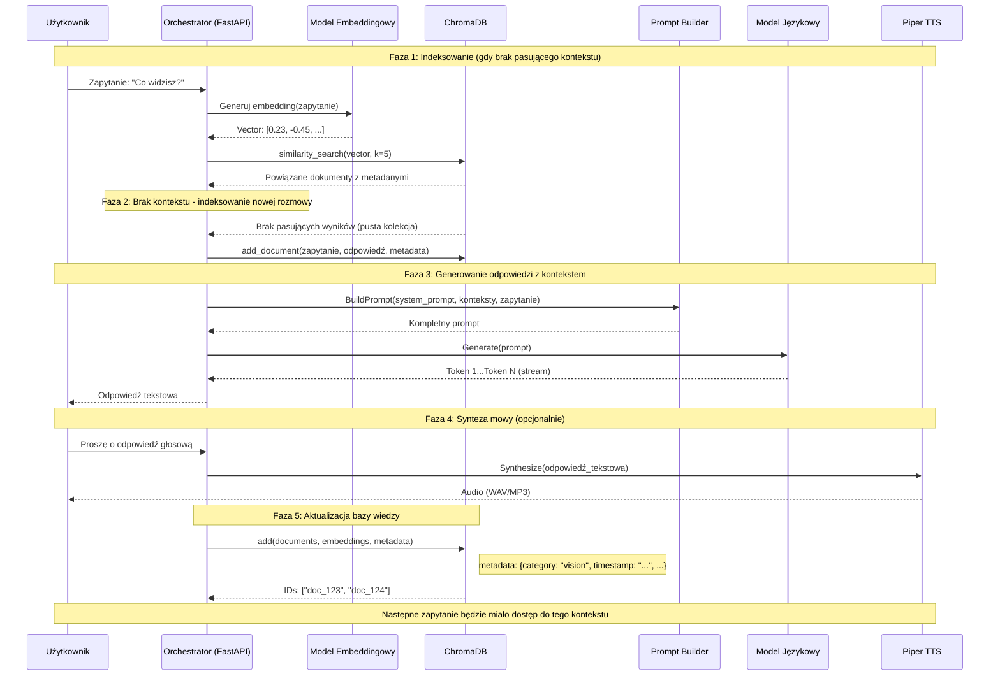

##### Diagram Schematu Bazy Danych ChromaDB

Poniższy diagram przedstawia strukturę danych w bazie wektorowej ChromaDB wykorzystywanej przez system watus_jetson do przechowywania kontekstu konwersacji:

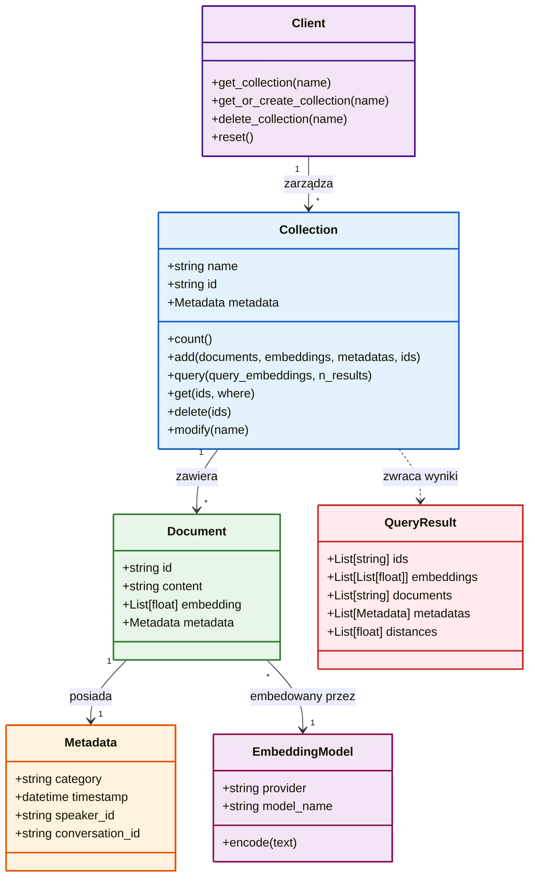

**Konfiguracja ChromaDB:**

```python
import chromadb
from chromadb.config import Settings

# Inicjalizacja klienta ChromaDB
client = chromadb.Client(Settings(
    chroma_db_impl="duckdb+parquet",
    persist_directory="./chroma_db"
))

# Tworzenie lub pobieranie kolekcji
collection = client.get_or_create_collection(
    name="conversations",
    metadata={"hnsw:space": "cosine"}
)
```

#### Integracja z Modelami Językowymi

Warstwa LLM wykorzystuje bibliotekę **`pydantic-ai`**, która zapewnia ujednolicony interfejs dla różnych dostawców modeli oraz silne typowanie danych wejściowych i wyjściowych. Dzięki temu zmiana modelu (np. z GPT-4 na Gemini) wymaga jedynie zmiany konfiguracji, a nie logiki kodu.

**Ujednolicona definicja Agenta:**

```python
from pydantic_ai import Agent, RunContext
from pydantic_ai.models.gemini import GeminiModel
from pydantic_ai.models.openai import OpenAIModel
from pydantic_ai.models.anthropic import AnthropicModel
import os

# 1. Wybór modelu na podstawie konfiguracji
provider = os.getenv("LLM_PROVIDER", "gemini")

if provider == "gemini":
    model = GeminiModel(
        model_name=os.getenv("GEMINI_MODEL", "gemini-1.5-flash"),
        api_key=os.getenv("GEMINI_API_KEY")
    )
elif provider == "openai":
    model = OpenAIModel(
        model_name=os.getenv("OPENAI_MODEL", "gpt-4o"),
        api_key=os.getenv("OPENAI_API_KEY")
    )
elif provider == "anthropic":
    model = AnthropicModel(
        model_name=os.getenv("ANTHROPIC_MODEL", "claude-3-5-sonnet"),
        api_key=os.getenv("ANTHROPIC_API_KEY")
    )

# 2. Definicja Agenta z kontekstem i narzędziami
agent = Agent(
    model,
    system_prompt="Jesteś Watus, inteligentnym asystentem robota Jetson.",
    deps_type=dict  # Typ zależności (np. kontekst świata)
)

# 3. Uruchomienie (interfejs jest identyczny dla każdego modelu)
async def process_query(user_text: str, world_context: dict):
    result = await agent.run(user_text, deps=world_context)
    return result.data
```

To podejście znacznie upraszcza kod i pozwala na łatwe dodawanie nowych modeli (w tym lokalnych przez OpenAI-compatible API) bez modyfikacji logiki biznesowej.

#### Klasyfikacja Zapytań

System implementuje mechanizm klasyfikacji zapytań, który automatycznie określa kategorię pytania i wybiera odpowiednią strategię przetwarzania. Klasyfikacja pozwala na efektywne routing'owanie zapytań do właściwych modeli oraz optymalizację prompt'ów dla różnych typów interakcji.

**Kategorie zapytań:**


| Kategoria            | Opis                                                | Przykłady                                |
| -------------------- | --------------------------------------------------- | ----------------------------------------- |
| dozwolone            | Standardowe pytania w zakresie możliwości systemu | "Co widzisz?", "Opisz otoczenie"          |
| wymagające_akcji    | Pytania wymagające wykonania akcji                 | "Zapisz to", "Wyślij wiadomość"        |
| poważne             | Pytania o bezpieczeństwo lub nietypowe zachowanie  | "Czy jest bezpiecznie?", "Wyjdź"         |
| wymagające_narzedzi | Pytania wymagające narzędzi zewnętrznych         | "Sprawdź pogodę", "Szukaj w internecie" |

### Consolidator

Consolidator jest kluczowym komponentem systemu odpowiedzialnym za agregację i synchronizację danych pochodzących z różnych źródeł sensorycznych. Moduł subskrybuje wiadomości ze wszystkich portów szyny ZMQ, agreguje dane w określonych oknach czasowych i przygotowuje zunifikowany kontekst dla warstwy LLM.

#### Funkcjonalność Główna

Głównym zadaniem consolidatora jest przekształcenie asynchronicznych strumieni danych w synchroniczny, skonsolidowany widok stanu systemu. Każde źródło danych (wizja, audio, LiDAR) publikuje informacje we własnym tempie i formacie — consolidator normalizuje te dane, łączy je czasowo i udostępnia jako spójny kontekst.

**Kluczowe operacje:**

1. **Subskrypcja strumieni:** Consolidator subskrybuje wiadomości z wszystkich portów ZMQ używanych przez warstwy percepcyjne.
2. **Buforowanie czasowe:** Przychodzące wiadomości są buforowane w oknach czasowych (domyślnie 500ms). W każdym oknie konsolidowane są wszystkie dane od ostatniego okna.
3. **Normalizacja formatu:** Różne formaty danych są przekształcane do wspólnego schematu JSON.
4. **Priorytetyzacja:** W przypadku konfliktu lub braku danych, system stosuje zdefiniowane reguły priorytetyzacji.
5. **Publikacja wyniku:** Skonsolidowane dane są publikowane na dedykowanym porcie lub przekazywane bezpośrednio do warstwy LLM.

#### Konfiguracja Consolidatora

Pliku `consolidator.json` definiuje parametry agregacji i synchronizacji danych:

```json
{
    "aggregation": {
        "window_size_ms": 500,
        "max_buffer_size": 100,
        "timeout_ms": 1000
    },
    "subscribers": {
        "vision": {
            "port": 5555,
            "topic": "",
            "enabled": true
        },
        "audio": {
            "port": 5556,
            "topic": "",
            "enabled": true
        },
        "lidar": {
            "port": 5557,
            "topic": "",
            "enabled": true
        }
    },
    "output": {
        "format": "json",
        "destination": "llm"
    },
    "filters": {
        "min_confidence": 0.3,
        "max_objects": 20
    }
}
```

#### Format Wyjściowy

Consolidator generuje zunifikowany obiekt kontekstowy w formacie JSON:

```json
{
    "timestamp": "2025-12-29T03:20:54.500000Z",
    "window_id": 2847,
    "vision": {
        "frame_id": 1423,
        "detections_count": 2,
        "detections": [...],
        "dominant_class": "person",
        "scene_description": "Osoba stoi przed samochodem"
    },
    "audio": {
        "last_transcript": "Co znajduje się przede mną?",
        "speaker_id": "user_1",
        "vad_active": false
    },
    "lidar": {
        "points_count": 15420,
        "obstacles": [...],
        "distance_to_obstacle": 2.5,
        "clear_path": true
    },
    "metadata": {
        "processing_time_ms": 45,
        "data_quality": 0.92
    }
}
```

### LiDAR

Moduł LiDAR odpowiada za przetwarzanie danych z czujników odległości generujących chmury punktów 3D. Informacje te są kluczowe dla robotów mobilnych, umożliwiając nawigację, wykrywanie przeszkód oraz mapowanie otoczenia.

#### Architektura Przetwarzania

Przetwarzanie danych LiDAR składa się z kilku etapów, od surowych danych do semantycznego opisu sceny:

1. **Odbiór danych:** Moduł odbiera surowe dane z czujnika LiDAR poprzez protokół UDP lub TCP, w zależności od modelu czujnika.
2. **Rekonstrukcja chmury punktów:** Surowe odległości i kąty są przekształcane w trójwymiarową chmurę punktów (X, Y, Z + intensywność odbicia).
3. **Filtracja szumów:** Stosowane są algorytmy filtracji (np. filtracja statystyczna, filtracja promieniowa) w celu usunięcia wartości odstających i szumów pomiarowych.
4. **Segmentacja:** Chmura punktów jest dzielona na segmenty odpowiadające różnym obiektom lub powierzchniom (podłoga, ściany, obiekty ruchome).
5. **Ekstrakcja cech:** Z wysegmentowanych chmur ekstrahowane są kluczowe cechy: płaszczyzny, krawędzie, charakterystyki powierzchniowe.
6. **Wykrywanie obiektów:** Na podstawie cech identyfikowane są konkretne obiekty (ściany, meble, przeszkody, ludzie).
7. **Publikacja wyników:** Przetworzone dane są publikowane na szynę ZMQ w formacie JSON.

#### Typy Obsługiwanych Czujników

Moduł LiDAR wspiera szeroką gamę czujników dostępnych na rynku:


| Czujnik              | Typ            | Zasięg | Charakterystyka                    |
| -------------------- | -------------- | ------- | ---------------------------------- |
| Velodyne VLP-16      | Wielowiązkowy | 100m    | 16 wiązek, 360° horyzont         |
| Velodyne Puck        | Wielowiązkowy | 100m    | Kompaktowy, 16 wiązek             |
| Ouster OS1-64        | Wielowiązkowy | 120m    | 64 wiązki, wysoka rozdzielczość |
| Hokuyo UST-10LX      | Jednowiązkowy | 10m     | Skaner planarny, 270°             |
| Intel RealSense L515 | Wielowiązkowy | 9m      | LiDAR Solid-state, RGB-D           |

#### Format Danych Wyjściowych

Moduł LiDAR publikuje dane w formacie JSON zawierającym zsemantyzowany opis sceny:

```json
{
    "timestamp": "2025-12-29T03:20:54.100000Z",
    "scan_id": 2847,
    "point_cloud": {
        "points_count": 15420,
        "bounds": {
            "min": [-5.2, -3.1, 0.0],
            "max": [5.2, 8.5, 2.5]
        }
    },
    "obstacles": [
        {
            "id": 1,
            "type": "person",
            "position": [1.2, 3.4, 0.0],
            "dimensions": [0.5, 0.3, 1.7],
            "confidence": 0.89,
            "tracking_id": "obs_42"
        },
        {
            "id": 2,
            "type": "wall",
            "position": [5.0, 0.0, 1.5],
            "dimensions": [0.1, 10.0, 3.0],
            "confidence": 0.98,
            "tracking_id": null
        }
    ],
    "clear_path": true,
    "nearest_obstacle_distance": 1.2,
    "navigation_suggestion": "path_clear"
}
```

---

## Konfiguracja

### Plik Środowiskowy .env

System watus_jetson wykorzystuje plik `.env` do przechowywania konfiguracji środowiskowej, w tym kluczy API i parametrów systemowych. Przykładowa konfiguracja znajduje się w pliku `.env.example` w katalogu `warstwa_llm`.

**Struktura pliku .env:**

```bash
# ==========================================
# KONFIGURACJA API DUŻYCH MODELI JĘZYKOWYCH
# ==========================================

# Google Gemini
GEMINI_API_KEY=your_gemini_api_key_here
GEMINI_MODEL=gemini-1.5-flash

# OpenAI
OPENAI_API_KEY=your_openai_api_key_here
OPENAI_MODEL=gpt-4o

# Anthropic Claude
ANTHROPIC_API_KEY=your_anthropic_api_key_here
ANTHROPIC_MODEL=claude-3-5-sonnet-20241022

# ==========================================
# KONFIGURACJA MODELI LOKALNYCH
# ==========================================

# Lokalny serwer Ollama
OLLAMA_BASE_URL=http://localhost:11434
OLLAMA_MODEL=llama3

# ==========================================
# KONFIGURACJA AUDIO
# ==========================================

# Ścieżka do modelu Piper TTS
PIPER_MODEL_PATH=models/piper/pl_PL-darkman-medium.onnx

# Dostawca STT (faster-whisper lub remote)
STT_PROVIDER=faster-whisper

# Model Whisper do transkrypcji
WHISPER_MODEL=small

# Słowa aktywujące (wake words)
WAKE_WORDS=watus,hej watus

# Częstotliwość próbkowania audio
WATUS_SR=16000

# Urządzenie wejściowe audio (nazwa lub indeks)
WATUS_INPUT_DEVICE=default

# Urządzenie wyjściowe audio
WATUS_OUTPUT_DEVICE=default

# ==========================================
# KONFIGURACJA ZMQ
# ==========================================

# Adres IP brokera ZMQ
ZMQ_HOST=127.0.0.1

# Porty dla poszczególnych warstw
ZMQ_PORT_VISION=5555
ZMQ_PORT_AUDIO=5556
ZMQ_PORT_LIDAR=5557
ZMQ_PORT_TTS=7781

# ==========================================
# KONFIGURACJA BAZY DANYCH
# ==========================================

# Ścieżka do bazy ChromaDB
CHROMA_DB_PATH=./chroma_db

# ==========================================
# KONFIGURACJA KAMERY
# ==========================================

# Indeks kamery lub URL RTSP
CAMERA_INDEX=0
# CAMERA_RTSP_URL=rtsp://adres:554/stream

# Rozdzielczość obrazu
CAMERA_WIDTH=1280
CAMERA_HEIGHT=720

# Liczba klatek na sekundę
CAMERA_FPS=30
```

### Pliki Konfiguracyjne JSON

Oprócz pliku środowiskowego, system wykorzystuje pliki JSON do konfiguracji poszczególnych komponentów:

**`consolidator.json`** — Konfiguracja modułu agregacji danych

```json
{
    "version": "1.0",
    "name": "Watus Consolidator",
    "description": "Agregator danych sensorycznych dla systemu Watus",
    "websocket": {
        "host": "0.0.0.0",
        "port": 8765
    },
    "subscribers": {
        "vision": {
            "protocol": "tcp",
            "host": "*",
            "port": 5555,
            "socket_type": "SUB",
            "topics": [""],
            "buffer_size": 1000
        },
        "audio": {
            "protocol": "tcp",
            "host": "*",
            "port": 5556,
            "socket_type": "SUB",
            "topics": [""],
            "buffer_size": 500
        },
        "lidar": {
            "protocol": "tcp",
            "host": "*",
            "port": 5557,
            "socket_type": "SUB",
            "topics": [""],
            "buffer_size": 500
        }
    },
    "aggregation": {
        "window_size_ms": 500,
        "max_wait_ms": 1000,
        "drop_old": false
    },
    "outputs": {
        "websocket": {
            "enabled": true
        },
        "llm_api": {
            "enabled": true,
            "endpoint": "http://127.0.0.1:8000/api1/process_question"
        },
        "file": {
            "enabled": false,
            "path": "/tmp/consolidated.jsonl"
        }
    },
    "logging": {
        "level": "INFO",
        "format": "json"
    }
}
```

**`camera.json`** — Konfiguracja warstwy wizji

```json
{
    "camera": {
        "source": "/dev/video0",
        "backend": "cv2",
        "width": 1280,
        "height": 720,
        "fps": 30,
        "fourcc": "MJPG",
        "warmup_frames": 30
    },
    "detection": {
        "model": {
            "type": "ultralytics",
            "name": "yolov8s.pt",
            "pretrained": true,
            "classes": null
        },
        "parameters": {
            "conf_thres": 0.5,
            "iou_thres": 0.45,
            "max_det": 100,
            "agnostic_nms": false,
            "classes": null
        },
        "device": "cuda:0"
    },
    "tracking": {
        "enabled": true,
        "tracker": "bytetrack",
        "conf_thres": 0.3,
        "iou_thres": 0.7
    },
    "output": {
        "format": "jsonl",
        "file": "camera.jsonl",
        "mqtt": null,
        "zmq": {
            "enabled": true,
            "host": "127.0.0.1",
            "port": 5555,
            "topic": "vision.detections"
        }
    },
    "performance": {
        "half_precision": true,
        "batch_size": 1,
        "num_workers": 4
    }
}
```

---

## Uruchamianie Systemu

### Sekwencja Uruchamiania

System watus_jetson składa się z wielu niezależnych komponentów, które muszą być uruchomione w odpowiedniej kolejności. Nieprawidłowa sekwencja może prowadzić do błędów komunikacji lub niedostępności usług.

**Kolejność uruchamiania:**

1. **Serwer LLM (FastAPI)** — Musi być uruchomiony jako pierwszy, ponieważ inne komponenty mogą wysyłać do niego zapytania HTTP
2. **Consolidator** — Inicjalizuje połączenia ZMQ i przygotowuje się do odbioru danych
3. **Warstwa Wizji** — Publikuje dane detekcji na szynie ZMQ
4. **Warstwa LiDAR** — Publikuje dane przestrzenne na szynie ZMQ
5. **Warstwa Audio** — Inicjalizuje wszystkie podsystemy audio i rozpoczyna nasłuch

### Polecenia Uruchamiania

**Terminal 1 — Serwer LLM:**

```bash
cd warstwa_llm
source ../watus_env/bin/activate
python src/main.py
```

**Terminal 2 — Consolidator:**

```bash
cd consolidator
source ../watus_env/bin/activate
python consolidator.py
```

**Terminal 3 — Warstwa Wizji:**

```bash
cd warstwa_wizji
source ../watus_env/bin/activate
python main.py
```

**Terminal 4 — Warstwa LiDAR:**

```bash
cd lidar
source ../watus_env/bin/activate
python run.py
```

**Terminal 5 — Warstwa Audio:**

```bash
cd warstwa_audio
source ../watus_env/bin/activate
python run_watus.py
```

### Uruchamianie za Pomocą Skryptu Orkiestrującego

Dla ułatwienia uruchamiania systemu, można wykorzystać skrypt orkiestrujący, który automatycznie uruchamia wszystkie komponenty w odpowiedniej kolejności:

```bash
#!/bin/bash
# start_system.sh

echo "=== Uruchamianie systemu Watus Jetson ==="

# Sprawdzenie środowiska
if [ ! -d "watus_env" ]; then
    echo "Błąd: Środowisko wirtualne nie istnieje. Uruchom setup.sh najpierw."
    exit 1
fi

# Uruchomienie komponentów w tle
echo "[1/5] Uruchamianie serwera LLM..."
cd warstwa_llm
source ../watus_env/bin/activate
python src/main.py > logs/llm.log 2>&1 &
LLM_PID=$!
echo "Serwer LLM uruchomiony (PID: $LLM_PID)"

echo "[2/5] Uruchamianie consolidatora..."
cd ../consolidator
source ../watus_env/bin/activate
python consolidator.py > logs/consolidator.log 2>&1 &
CONS_PID=$!
echo "Consolidator uruchomiony (PID: $CONS_PID)"

echo "[3/5] Uruchamianie warstwy wizji..."
cd ../warstwa_wizji
source ../watus_env/bin/activate
python main.py > logs/vision.log 2>&1 &
VISION_PID=$!
echo "Warstwa wizji uruchomiona (PID: $VISION_PID)"

echo "[4/5] Uruchamianie warstwy LiDAR..."
cd ../lidar
source ../watus_env/bin/activate
python run.py > logs/lidar.log 2>&1 &
LIDAR_PID=$!
echo "Warstwa LiDAR uruchomiona (PID: $LIDAR_PID)"

echo "[5/5] Uruchamianie warstwy audio..."
cd ../warstwa_audio
source ../watus_env/bin/activate
python run_watus.py > logs/audio.log 2>&1 &
AUDIO_PID=$!
echo "Warstwa audio uruchomiona (PID: $AUDIO_PID)"

echo ""
echo "=== System Watus Jetson uruchomiony ==="
echo "PIDs: LLM=$LLM_PID, Consolidator=$CONS_PID, Wizja=$VISION_PID, LiDAR=$LIDAR_PID, Audio=$AUDIO_PID"
echo "Logi dostępne w katalogu logs/"
```

### Weryfikacja Działania

Po uruchomieniu wszystkich komponentów, weryfikację poprawności działania można przeprowadzić poprzez sprawdzenie logów oraz endpointu zdrowia serwera LLM:

```bash
# Sprawdzenie statusu serwera LLM
curl http://localhost:8000/api1/health

# Oczekiwana odpowiedź:
# {"status": "healthy", "components": {...}}
```

---

## Rozwiązywanie Problemów

### Problemy z Pamięcią GPU (OOM)

Błędy Out of Memory są jednymi z najczęstszych problemów podczas uruchamiania systemu na urządzeniach z ograniczoną pamięcią GPU.

**Objawy:**

```
RuntimeError: CUDA out of memory. Tried to allocate 2.00 GiB
```

**Rozwiązania:**

1. **Zmniejszenie rozmiaru modelu detekcji:**

```python
# Zamiast yolov8m.pt użyj yolov8n.pt
model = YOLO('yolov8n.pt')
```

2. **Włączenie precyzji FP16:**

```python
model = YOLO('yolov8n.pt')
model.predict(..., half=True)  # Używa połówkowej precyzji
```

3. **Zmniejszenie rozmiaru obrazu wejściowego:**

```python
model.predict(..., imgsz=320)  # Zamiast domyślnych 640
```

4. **Ustawienie limitu pamięci PyTorch:**

```python
import torch
torch.cuda.set_per_process_memory_fraction(0.7)  # Max 70% pamięci
```

### Problemy z Dostępem do Urządzeń Audio

Problemy z mikrofonem lub głośnikami często wynikają z nieprawidłowej konfiguracji ALSA lub braku uprawnień.

**Objawy:**

```
PortAudioError: No Default Input Device Available
```

**Rozwiązania:**

1. **Sprawdzenie dostępnych urządzeń:**

```python
import sounddevice as sd
print(sd.query_devices())
```

2. **Ustawienie konkretnego urządzenia w .env:**

```bash
WATUS_INPUT_DEVICE="USB PnP Sound Device"
WATUS_OUTPUT_device="USB PnP Sound Device"
```

3. **Sprawdzenie uprawnień:**

```bash
# Dodanie użytkownika do grup audio
sudo usermod -aG audio $USER
# Wylogowanie i ponowne zalogowanie wymagane
```

4. **Reinstalacja sterowników ALSA:**

```bash
sudo apt-get remove --purge alsa-utils pulseaudio
sudo apt-get install alsa-utils pulseaudio
```

### Problemy z Komunikacją ZMQ

Błędy komunikacji między komponentami często wynikają z konfliktów portów lub nieprawidłowej konfiguracji sieciowej.

**Objawy:**

```
ZMQError: Address already in use
ConnectionRefusedError
```

**Rozwiązania:**

1. **Sprawdzenie zajętych portów:**

```bash
sudo lsof -i :5555
sudo lsof -i :5556
sudo lsof -i :5557
```

2. **Zmiana portów w konfiguracji:**

```json
// W pliku consolidator.json
"subscribers": {
    "vision": {
        "port": 5558  // Zmiana portu
    }
}
```

3. **Zabicie procesów używających portów:**

```bash
sudo kill $(sudo lsof -t -i:5555)
```

4. **Sprawdzenie firewalla:**

```bash
sudo ufw status
sudo ufw allow 5555/tcp
sudo ufw allow 5556/tcp
sudo ufw allow 5557/tcp
```

### Problemy z Modelami Whisper

Transkrypcja może działać nieprawidłowo z powodu niekompatybilnych wersji bibliotek lub nieprawidłowej ścieżki do modelu.

**Objawy:**

```
ValueError: Invalid model size specified
FileNotFoundError: Model file not found
```

**Rozwiązania:**

1. **Weryfikacja poprawnej nazwy modelu:**

```python
# Poprawne nazwy: tiny, base, small, medium, large, large-v3
model = WhisperModel("small")  # POPRAWNIE
model = WhisperModel("small-v2")  # BŁĄD
```

2. **Usunięcie cache modelu i pobranie ponownie:**

```bash
rm -rf ~/.cache/huggingface/hub/*
```

3. **Sprawdzenie wersji faster-whisper:**

```bash
pip show faster-whisper
# Wymagana wersja: 1.0.0 lub wyższa
```

### Problemy z CUDA

Nieprawidłowa konfiguracja środowiska CUDA może powodować, że obliczenia nie będą wykonywane na GPU.

**Objawy:**

```
UserWarning: CUDA is not available
torch.cuda.is_available() zwraca False
```

**Rozwiązania:**

1. **Weryfikacja instalacji CUDA:**

```bash
nvcc --version
nvidia-smi
```

2. **Sprawdzenie wersji PyTorch:**

```python
import torch
print(torch.__version__)
print(torch.version.cuda)
```

3. **Reinstalacja PyTorch z odpowiednią wersją CUDA:**

```bash
pip uninstall torch torchvision torchaudio
pip install --index-url https://download.pytorch.org/whl/cu124 torch==2.6.* torchvision==0.21.* torchaudio==2.6.*
```

4. **Ustawienie zmiennej środowiskowej:**

```bash
export CUDA_VISIBLE_DEVICES=0
```

### Problemy z API LLM

Błędy komunikacji z zewnętrznymi API modeli językowych mogą wynikać z nieprawidłowych kluczy API lub problemów sieciowych.

**Objawy:**

```
AuthenticationError: Invalid API Key
RateLimitError: Too many requests
```

**Rozwiązania:**

1. **Weryfikacja kluczy API w pliku .env:**

```bash
# Sprawdzenie czy plik .env istnieje i ma poprawną strukturę
cat warstwa_llm/.env
```

2. **Sprawdzenie limitów API:**

```python
# Dla OpenAI - sprawdzenie rate limit
import openai
try:
    response = client.models.list()
except openai.RateLimitError as e:
    print(f"Rate limit exceeded: {e}")
```

3. **Sprawdzenie połączenia sieciowego:**

```bash
ping api.openai.com
curl https://api.openai.com/v1/models
```

4. **Implementacja retry logic:**

```python
import time
from tenacity import retry, stop_after_attempt, wait_exponential

@retry(stop=stop_after_attempt(3), wait=wait_exponential(multiplier=1))
def call_llm_api(prompt):
    response = client.chat.completions.create(
        model="gpt-4o",
        messages=[{"role": "user", "content": prompt}]
    )
    return response
```

---

## Diagramy Przepływu Danych

W tej sekcji przedstawiono szczegółowe diagramy przepływu danych dla poszczególnych komponentów systemu, które wizualnie ilustrują procesy przetwarzania informacji w module watus_jetson.

### Diagram Przepływu Danych Warstwy Wizji

Poniższy diagram przedstawia szczegółowy przepływ danych w warstwie wizji od momentu przechwycenia obrazu z kamery do publikacji wyników detekcji na szynie ZMQ:

```mermaid
graph LR
    subgraph Sprzęt["Warstwa Sprzętowa"]
        KameraCSI["Kamera CSI/USB"]
        Strumień["Strumień Video"]
    end

    subgraph Przechwytywanie["1. Przechwytywanie"]
        OpenCV["OpenCV Capture"]
        BuforKlatek["Bufor Klatek"]
        KonwersjaBGR["Konwersja BGR → RGB"]
    end

    subgraph Przetwarzanie["2. Preprocessing"]
        Resize["Resize (640×640)"]
        Normalizacja["Normalizacja [0,1]"]
        HWC2CHW["HWC → CHW"]
        Tensor["Tensor (NCHW)"]
    end

    subgraph Inferencja["3. Inferencja Modelu"]
        GPU["GPU CUDA"]
        Backbone["Backbone (CSPNet)"]
        Neck["Neck (PANet)"]
        Head["Detection Head"]
        TensorOut["Tensor Wyjściowy"]
    end

    subgraph Postprocessing["4. Postprocessing"]
        NMS["Non-Maximum Suppression"]
        Filtrowanie["Filtrowanie progu"]
        Scaling["Scaling BBox"]
        Klasy["Mapowanie Klas (COCO)"]
    end

    subgraph Wyjście["5. Publikacja"]
        JSON["Serializacja JSON"]
        PublikacjaZMQ["ZMQ PUB (port 5555)"]
        PlikJSONL["Zapis do camera.jsonl"]
    end

    KameraCSI --> Strumień
    Strumień --> OpenCV
    OpenCV --> BuforKlatek
    BuforKlatek --> KonwersjaBGR
    KonwersjaBGR --> Resize
    Resize --> Normalizacja
    Normalizacja --> HWC2CHW
    HWC2CHW --> Tensor
    Tensor --> GPU
    GPU --> Backbone
    Backbone --> Neck
    Neck --> Head
    Head --> TensorOut
    TensorOut --> NMS
    NMS --> Filtrowanie
    Filtrowanie --> Scaling
    Scaling --> Klasy
    Klasy --> JSON
    JSON --> PublikacjaZMQ
    JSON --> PlikJSONL

    classDef hardware fill:#e1f5fe,stroke:#01579b
    classDef process fill:#f3e5f5,stroke:#4a148c
    classDef model fill:#e8f5e9,stroke:#1b5e20
    classDef output fill:#fff3e0,stroke:#e65100

    class KameraCSI,Strumień hardware
    class OpenCV,BuforKlatek,KonwersjaBGR,Resize,Normalizacja,HWC2CHW process
    class GPU,Backbone,Neck,Head,Tensor,TensorOut model
    class JSON,PublikacjaZMQ,PlikJSONL output
```

### Diagram Przepływu Danych Warstwy LiDAR

Poniższy diagram przedstawia przepływ danych w module LiDAR od surowych pomiarów odległości do semantycznego opisu przeszkód i publikacji wyników:

```mermaid
graph LR
    subgraph Sprzęt["Źródło Danych"]
        LiDAR["Czujnik LiDAR"]
        Protokół["UDP/TCP"]
    end

    subgraph Surowe["Przetwarzanie Surowych Danych"]
        Odbiór["Odbiór Pakietów"]
        Dekodowanie["Dekodowanie Scan Data"]
        ChmuraPkt["Chmura Punktów (X,Y,Z,I)"]
    end

    subgraph Filtracja["Filtracja i Przetwarzanie"]
        StatFilt["Filtracja Statystyczna"]
        VoxelGrid["Voxel Grid Filter"]
        ROI["Crop ROI"]
        UsuwaniePodłogi["RANSAC - Podłoga"]
    end

    subgraph Analiza["Analiza i Segmentacja"]
        Euclidean["Euclidean Clustering"]
        Segmenty["Segmenty Obiektów"]
        AABB["Bounding Box (AABB)"]
        Cechy["Ekstrakcja Cech"]
    end

    subgraph Semantyka["Semantyka"]
        Klasyfikacja["Klasyfikacja Obiektów"]
        Tracking["Multi-Object Tracking"]
        Pozycja["Pozycja 3D"]
        Wymiary["Wymiary"]
    end

    subgraph Wyjście["Publikacja"]
        JSON["Serializacja JSON"]
        ZMQ["ZMQ PUB (port 5557)"]
    end

    LiDAR --> Protokół
    Protokół --> Odbiór
    Odbiór --> Dekodowanie
    Dekodowanie --> ChmuraPkt
    ChmuraPkt --> StatFilt
    StatFilt --> VoxelGrid
    VoxelGrid --> ROI
    ROI --> UsuwaniePodłogi
    UsuwaniePodłogi --> Euclidean
    Euclidean --> Segmenty
    Segmenty --> AABB
    AABB --> Cechy
    Cechy --> Klasyfikacja
    Klasyfikacja --> Tracking
    Tracking --> Pozycja
    Pozycja --> Wymiary
    Wymiary --> JSON
    JSON --> ZMQ

    classDef hardware fill:#e1f5fe,stroke:#01579b
    classDef processing fill:#f3e5f5,stroke:#4a148c
    classDef analysis fill:#e8f5e9,stroke:#1b5e20
    classDef semantic fill:#fff3e0,stroke:#e65100

    class LiDAR,Protokół hardware
    class Odbiór,Dekodowanie,ChmuraPkt,StatFilt,VoxelGrid,ROI,UsuwaniePodłogi processing
    class Euclidean,Segmenty,AABB,Cechy analysis
    class Klasyfikacja,Tracking,Pozycja,Wymiary semantic
    class JSON,ZMQ output
```

### Diagram Stanów Modułu VAD (Voice Activity Detection)

Poniższy diagram stanów przedstawia automat stanów dla modułu wykrywania aktywności głosowej, który określa, kiedy użytkownik mówi i kiedy należy aktywować proces transkrypcji:

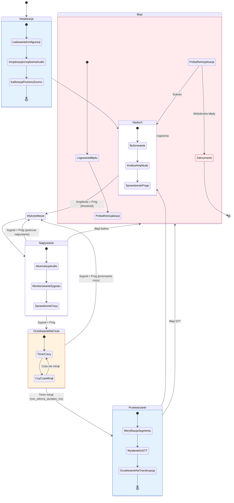


### Diagram Cyklu Życia Komponentu

Poniższy diagram stanów przedstawia typowy cykl życia każdego komponentu systemu watus_jetson, od momentu inicjalizacji do zatrzymania:

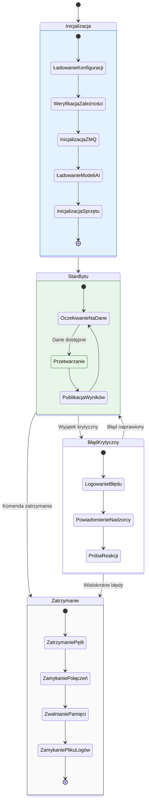
---

## Topologia Komunikacji

### Diagram Topologii Sieciowej ZMQ

Poniższy diagram przedstawia szczegółową topologię komunikacji ZMQ w systemie watus_jetson, pokazując wszystkie publisherów, subscriberów oraz tematy wiadomości:

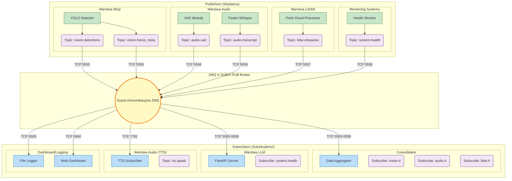
### Diagram Wdrożeniowy Systemu

Poniższy diagram przedstawia fizyczne rozmieszczenie komponentów systemu na platformie sprzętowej NVIDIA Jetson wraz z konteneryzacją:

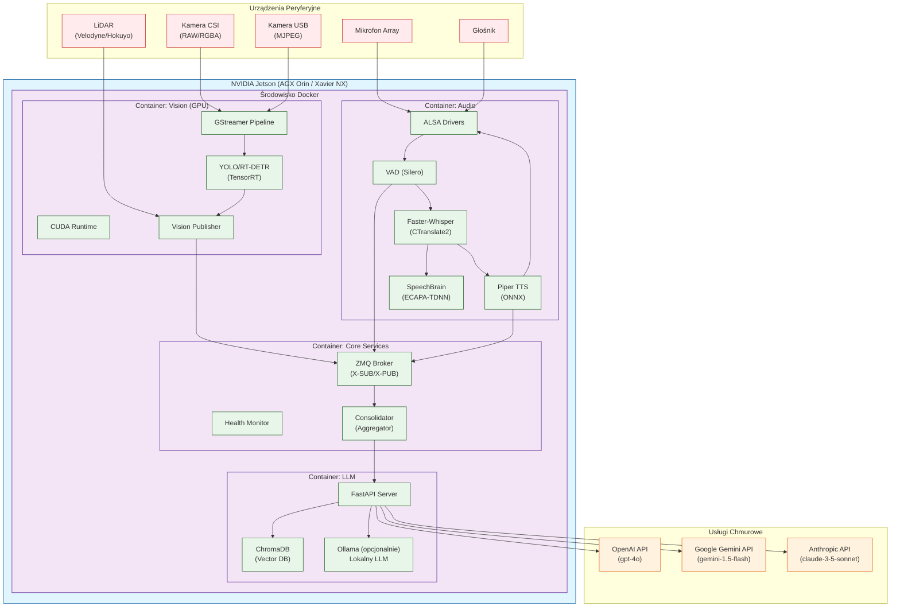
### Diagram Przepływu Błędów i Odzyskiwania

Poniższy diagram przedstawia mechanizm obsługi błędów i automatycznego odzyskiwania w systemie watus_jetson:

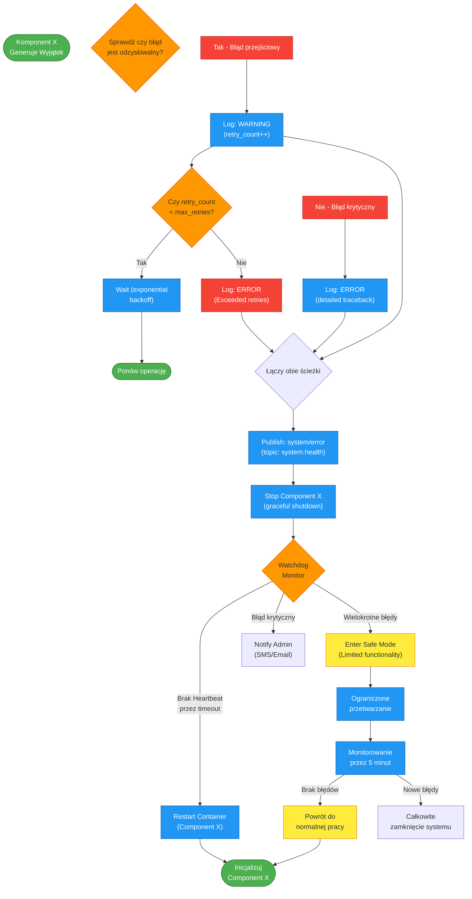
### Diagram Schematu Bazy Danych ChromaDB

Poniższy diagram przedstawia strukturę danych w bazie wektorowej ChromaDB wykorzystywanej przez system watus_jetson do przechowywania kontekstu konwersacji:

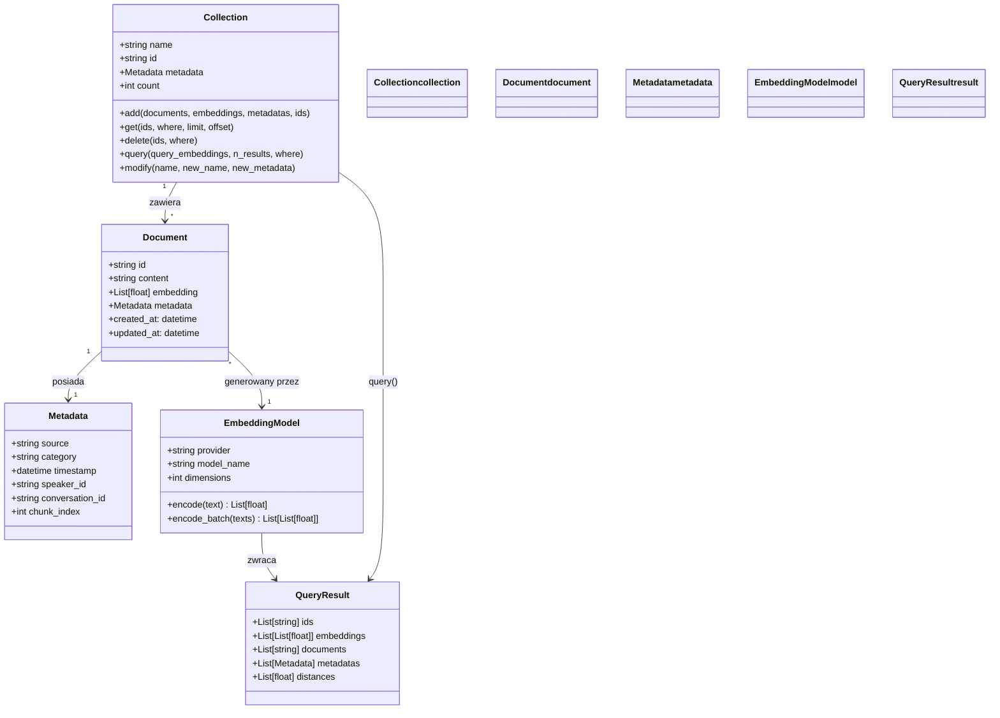
### Diagram Sekwencji Inicjalizacji Systemu

Poniższy diagram sekwencyjny przedstawia szczegółowy proces uruchamiania systemu watus_jetson wraz z zależnościami między komponentami:

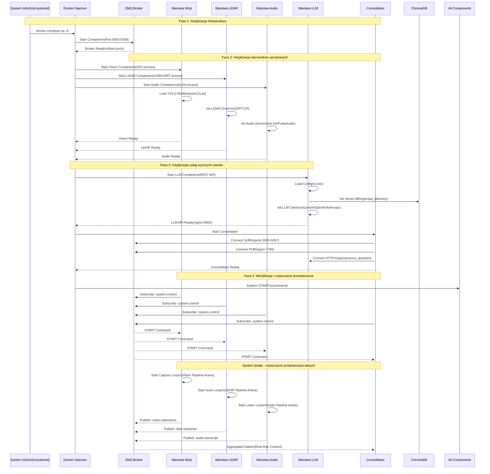
---

## 11. Optymalizacja i Wdrożenie na Jetson AGX Orin

Planowana jest migracja silników inferencji na natywne rozwiązania NVIDIA TensorRT, aby w pełni wykorzystać potencjał platformy Jetson AGX Orin. Poniżej znajduje się skrócony przewodnik optymalizacji (szczegóły w pliku `watus_jetson_optymalizacja.md`).

### Korzyści z TensorRT

- **10x szybszy First Token** dla LLM (200ms vs 2000ms).
- **6x więcej tokenów/s** (30 t/s vs 5 t/s).
- **5x szybsza detekcja YOLO** (15ms vs 80ms).

### Architektura Docelowa (High-Performance)

```
Jetson AGX Orin
├── OpenAI-Compatible API Server (TensorRT-LLM)
│   └── llama-7b.engine (FP16/INT8)
├── Watus Wizja
│   └── yolo12s.engine
└── Watus Audio
    └── piper.onnx (z akceleracją)
```
### Przewodnik Migracji (Skrót)

#### 1. Instalacja TensorRT-LLM

Wymagany JetPack 5.1+, CUDA 11.4+. Należy zbudować `TensorRT-LLM` ze źródeł lub użyć kontenera Docker NVIDIA L4T.

#### 2. Konwersja Modeli LLM

```bash
# 1. Pobranie modelu (np. Mistral-7B)
huggingface-cli download mistralai/Mistral-7B-Instruct-v0.2

# 2. Budowanie silnika .engine
trtllm-build --checkpoint_dir ./trt_ckpt \
             --output_dir ./trt_engine \
             --gemm_plugin float16 \
             --max_batch_size 4
```
#### 3. Konwersja YOLO

```python
from ultralytics import YOLO
model = YOLO("yolov8s.pt")
model.export(format="engine", device=0, half=True, workspace=4)
```
#### 4. Uruchomienie Serwera API

Należy uruchomić serwer fasady zgodny z OpenAI API, który pod spodem wykorzystuje `TensorRT-LLM`. Pozwoli to na bezinwazyjną integrację z `warstwa_llm` (zmiana `base_url` na localhost).

Więcej szczegółów, skrypty serwera i pełne instrukcje znajdują się w pliku **`watus_jetson_optymalizacja.md`**.

## 12. Hierarchia Wywołań Funkcji

Poniższy diagram przedstawia szczegółową hierarchię wywołań funkcji w systemie watus_jetson, pokazującą zależności między modułami oraz przepływ sterowania w kodzie źródłowym.

### Diagram Hierarchii Wywołań Funkcji

```mermaid
graph TB
    subgraph "warstwa_wizji/"
        subgraph "main.py"
            M_Main["main()"]:::entry
            M_InitCamera["init_camera()"]
            M_LoadModel["load_yolo_model()"]
            M_CaptureLoop["capture_frame_loop()"]:::loop
            M_ProcessLoop["process_detection_loop()"]:::loop
            M_PublishResults["publish_vision_results()"]
        end

        subgraph "src/"
            M_Preprocess["preprocess_image(frame)"]
            M_Inference["run_inference(tensor)"]
            M_Postprocess["postprocess_detections(results)"]
            M_NMS["non_max_suppression(detections)"]
            M_FormatOutput["format_detection_output()"]
        end

        M_Main --> M_InitCamera
        M_Main --> M_LoadModel
        M_InitCamera --> M_CaptureLoop
        M_LoadModel --> M_ProcessLoop
        M_CaptureLoop --> M_Preprocess
        M_Preprocess --> M_Inference
        M_Inference --> M_Postprocess
        M_Postprocess --> M_NMS
        M_NMS --> M_FormatOutput
        M_FormatOutput --> M_PublishResults
    end

    subgraph "warstwa_audio/"
        subgraph "run_watus.py"
            A_Main["main()"]:::entry
            A_InitAudio["init_audio_devices()"]
            A_InitVAD["init_vad_model()"]
            A_InitSTT["init_whisper_model()"]
            A_InitTTS["init_piper_tts()"]
            A_InitSpeaker["init_speaker_id()"]
            A_AudioPipeline["run_audio_pipeline()"]:::loop
        end

        subgraph "run_reporter.py"
            A_ZMQSub["zmq_subscribe_loop()"]:::loop
            A_ParseTranscript["parse_transcript()"]
            A_CallLLM["call_llm_api()"]
            A_HandleResponse["handle_llm_response()"]
            A_TriggerTTS["trigger_tts_synthesis()"]
        end

        subgraph "camera_runner.py"
            A_ReadContext["read_vision_context()"]
            A_BuildPrompt["build_context_prompt()"]
        end

        subgraph "watus_audio/"
            A_VADProcess["process_vad(audio_chunk)"]
            A_STTTranscribe["transcribe_audio(audio)"]
            A_SpeakerIdentify["identify_speaker(audio)"]
            A_TTSSynthesize["synthesize_speech(text)"]
        end

        A_Main --> A_InitAudio
        A_Main --> A_InitVAD
        A_Main --> A_InitSTT
        A_Main --> A_InitTTS
        A_Main --> A_InitSpeaker
        A_InitAudio --> A_AudioPipeline
        A_AudioPipeline --> A_VADProcess
        A_VADProcess --> A_STTTranscribe
        A_STTTranscribe --> A_SpeakerIdentify
        A_STTTranscribe --> A_ZMQSub
        A_ZMQSub --> A_ParseTranscript
        A_ParseTranscript --> A_ReadContext
        A_ReadContext --> A_BuildPrompt
        A_BuildPrompt --> A_CallLLM
        A_CallLLM --> A_HandleResponse
        A_HandleResponse --> A_TriggerTTS
        A_TriggerTTS --> A_TTSSynthesize
    end

    subgraph "warstwa_llm/"
        subgraph "src/main.py"
            L_Main["main()"]:::entry
            L_InitFastAPI["init_fastapi()"]
            L_InitClients["init_llm_clients()"]
            L_InitDB["init_chromadb()"]
            L_StartServer["start_server()"]:::loop
        end

        subgraph "src/vectordb.py"
            L_InitVectorDB["__init__()"]
            L_AddDocument["add_document()"]
            L_SearchContext["search_context()"]
            L_GetEmbedding["get_embedding()"]
            L_GetHistory["get_conversation_history()"]
            L_ClearContext["clear_context()"]
        end

        subgraph "src/__init__.py"
            L_LoadPrompts["load_system_prompts()"]
            L_BuildPrompt["build_rag_prompt()"]
            L_SelectModel["select_llm_model()"]
            L_FormatResponse["format_response()"]
        end

        L_Main --> L_InitFastAPI
        L_Main --> L_InitClients
        L_Main --> L_InitDB
        L_InitFastAPI --> L_StartServer
        L_StartServer --> L_LoadPrompts
        L_InitDB --> L_AddDocument
        L_InitDB --> L_SearchContext
        L_SearchContext --> L_GetEmbedding
        L_AddDocument --> L_GetEmbedding
        L_LoadPrompts --> L_BuildPrompt
        L_SearchContext --> L_BuildPrompt
        L_BuildPrompt --> L_SelectModel
        L_SelectModel --> L_FormatResponse
    end

    subgraph "lidar/"
        subgraph "run.py"
            LDR_Main["main()"]:::entry
            LDR_InitLiDAR["init_lidar_driver()"]
            LDR_Connect["connect_lidar()"]
            LDR_ScanLoop["run_scan_loop()"]:::loop
        end

        subgraph "run_vis.py"
            LDR_Visualize["visualize_point_cloud()"]
            LDR_ProcessData["process_lidar_data()"]
        end

        LDR_Main --> LDR_InitLiDAR
        LDR_InitLiDAR --> LDR_Connect
        LDR_Connect --> LDR_ScanLoop
        LDR_ScanLoop --> LDR_ProcessData
        LDR_ProcessData --> LDR_Visualize
    end

    subgraph "consolidator/"
        subgraph "consolidator.py"
            C_Main["main()"]:::entry
            C_InitZMQ["init_zmq_subscriber()"]
            C_ConnectVision["connect_vision_stream()"]
            C_ConnectAudio["connect_audio_stream()"]
            C_ConnectLiDAR["connect_lidar_stream()"]
            C_AggregateLoop["run_aggregation_loop()"]:::loop
            C_SyncTimestamps["synchronize_timestamps()"]
            C_BuildContext["build_context_payload()"]
            C_SendToLLM["send_to_llm()"]
        end

        C_Main --> C_InitZMQ
        C_InitZMQ --> C_ConnectVision
        C_InitZMQ --> C_ConnectAudio
        C_InitZMQ --> C_ConnectLiDAR
        C_ConnectVision --> C_AggregateLoop
        C_ConnectAudio --> C_AggregateLoop
        C_ConnectLiDAR --> C_AggregateLoop
        C_AggregateLoop --> C_SyncTimestamps
        C_SyncTimestamps --> C_BuildContext
        C_BuildContext --> C_SendToLLM
    end

    %% Międzymodułowe wywołania ZMQ
    M_PublishResults -.->|ZMQ PUB 5555| C_AggregateLoop
    A_ZMQSub -.->|ZMQ PUB 5556| C_AggregateLoop
    LDR_ProcessData -.->|ZMQ PUB 5557| C_AggregateLoop
    C_SendToLLM -.->|HTTP POST| L_StartServer
    A_CallLLM -.->|HTTP POST| L_StartServer
    A_TriggerTTS -.->|ZMQ SUB 7781| A_TTSSynthesize

    classDef entry fill:#4caf50,stroke:#2e7d32,color:white
    classDef loop fill:#2196f3,stroke:#1565c0,color:white
    classDef module fill:#ff9800,stroke:#e65100
    classDef external fill:#9c27b0,stroke:#4a148c,color:white

    class M_Main,A_Main,L_Main,LDR_Main,C_Main entry
    class M_CaptureLoop,M_ProcessLoop,A_AudioPipeline,A_ZMQSub,L_StartServer,LDR_ScanLoop,C_AggregateLoop loop
```
### Szczegółowa Hierarchia Wywołań według Modułów

#### 12.1 Warstwa Wizji (`warstwa_wizji/`)

Moduł warstwy wizji implementuje klasyczny pipeline przetwarzania obrazu z wykorzystaniem modeli detekcji obiektów. Główny punkt wejścia stanowi funkcja `main()` w pliku `main.py`, która orkiestruje całość procesu detekcji. Funkcja ta wywołuje kolejno `init_camera()` odpowiedzialną za konfigurację i uruchomienie strumienia wideo z kamery (lokalnej lub RTSP), oraz `load_yolo_model()` ładującą wybrany model detekcji do pamięci GPU. Po inicjalizacji uruchamiane są dwie równoległe pętle: `capture_frame_loop()` przechwytująca klatki ze strumienia wideo i umieszczająca je w buforze, oraz `process_detection_loop()` pobierająca klatki z bufora i wykonująca na nich inferencję modelu.

Funkcja `capture_frame_loop()` działa w trybie ciągłym, wykorzystując bibliotekę OpenCV do przechwytywania kolejnych klatek. Każda przechwycona klatka jest przekazywana do funkcji `preprocess_image()`, która wykonuje konwersję przestrzeni kolorów z BGR do RGB, zmianę rozmiaru do wymiarów oczekiwanych przez model (domyślnie 640×640 pikseli), normalizację wartości pikseli do zakresu [0, 1] oraz transformację z formatu HWC (Height-Width-Channels) do CHW (Channels-Height-Width). Tak przygotowany tensor jest następnie przekazywany do funkcji `run_inference()`, która wywołuje model YOLO lub RT-DETR na GPU.

Wyniki inferencji w postaci surowych tensorów są przetwarzane przez funkcję `postprocess_detections()`, która wywołuje `non_max_suppression()` w celu eliminacji nadmiarowych bounding boxów dla tych samych obiektów. Funkcja `format_detection_output()` formatuje wykryte obiekty do struktury JSON zawierającej klasę obiektu, współrzędne bounding boxa, współczynnik ufności oraz pole powierzchni. Na końcu `publish_vision_results()` publikuje sformatowane dane na gniazdo ZMQ na porcie 5555.

#### 12.2 Warstwa Audio (`warstwa_audio/`)

Warstwa audio stanowi najbardziej złożony moduł systemu, integrujący cztery niezależne podsystemy przetwarzania mowy. Główny orchestrator `run_watus.py` zawiera funkcję `main()` inicjalizującą wszystkie komponenty poprzez wywołanie `init_audio_devices()` konfigurującej urządzenia wejścia/wyjścia ALSA, `init_vad_model()` ładującą model wykrywania aktywności głosowej, `init_whisper_model()` inicjalizującą model Faster-Whisper do transkrypcji, `init_piper_tts()` konfigurującą syntetyzator mowy, oraz `init_speaker_id()` ładującą model identyfikacji mówcy SpeechBrain.

Główna pętl przetwarzania `run_audio_pipeline()` wywołuje cyklicznie `process_vad(audio_chunk)` z modułu `watus_audio/`, która analizuje fragmenty audio w poszukiwaniu segmentów zawierających mowę. Po wykryciu aktywności głosowej, segment audio jest przekazywany do `transcribe_audio()` wywołującej model Whisper. Wynikowa transkrypcja jest następnie przetwarzana przez `identify_speaker()` generującą wektor osadzeniowy głosu i porównującą go z bazą znanych mówców.

Równolegle działa `zmq_subscribe_loop()` z pliku `run_reporter.py`, która subskrybuje wiadomości z szyny ZMQ na porcie 7780 (temat `dialog.leader`). Po odebraniu transkrypcji wywoływana jest `parse_transultat()`, a następnie `read_vision_context()` z `camera_runner.py` pobierająca aktualny kontekst wizualny z pliku `camera.jsonl`. Funkcja `build_context_prompt()` łączy transkrypcję z kontekstem wizualnym w kompletny prompt, który jest wysyłany do LLM poprzez `call_llm_api()`. Odpowiedź LLM jest następnie przetwarzana przez `handle_response()` i `trigger_tts_synthesis()`, co inicjuje syntezę mowy przez `synthesize_speech()`.

#### 12.3 Warstwa LLM (`warstwa_llm/`)

Warstwa LLM zbudowana jest wokół serwera FastAPI obsługującego zapytania HTTP od pozostałych komponentów systemu. Funkcja `main()` w `src/main.py` inicjalizuje serwer poprzez `init_fastapi()` konfigurującą endpointy API, `init_llm_clients()` tworzącą połączenia z dostawcami modeli językowych (Google Gemini, OpenAI, Anthropic), oraz `init_chromadb()` inicjalizującą bazę wektorową.

Główna pętl serwera `start_server()` obsługuje przychodzące zapytania HTTP na endpoint `/api1/process_question`. Dla każdego zapytania wywoływana jest sekwencja funkcji: `load_system_prompts()` z `src/__init__.py` ładująca zdefiniowane prompty systemowe, `search_context()` z `src/vectordb.py` wyszukująca podobne konteksty w ChromaDB, `get_embedding()` generująca wektor osadzeniowy dla zapytania, oraz `build_rag_prompt()` konstruująca kompletny prompt zawierający system prompt, kontekst z bazy wektorowej oraz zapytanie użytkownika.

Funkcja `select_llm_model()` na podstawie kategorii zapytania wybiera odpowiedniego dostawcę LLM i wywołuje generowanie odpowiedzi. Wynikowy tekst jest formatowany przez `format_response()`, a cała interakcja (zapytanie i odpowiedź) jest zapisywana do bazy wektorowej poprzez `add_document()` dla przyszłego wykorzystania w mechanizmie RAG.

#### 12.4 Warstwa LiDAR (`lidar/`)

Moduł LiDAR jest odpowiedzialny za przetwarzanie danych z czujników odległości i generowanie semantycznego opisu przeszkód w otoczeniu. Funkcja `main()` w `run.py` wywołuje `init_lidar_driver()` konfigurującą połączenie z czujnikiem (UDP/TCP w zależności od modelu LiDAR), a następnie `connect_lidar()` nawiązującą fizyczne połączenie i inicjalizującą strumień danych.

Główna pętl `run_scan_loop()` cyklicznie pobiera dane z czujnika i przekazuje je do `process_lidar_data()`, która wykonuje dekodowanie surowych pakietów pomiarowych, konwersję na chmurę punktów 3D (X, Y, Z, Intensity), filtrację statystyczną usuwającą szumy outliers, voxel grid filtering redukujący liczbę punktów, segmentację podłogi algorytmem RANSAC oraz clustering przestrzenny metodą Euclidean Distance w celu identyfikacji oddzielnych obiektów.

Wizualizacja przetworzonych danych jest realizowana przez `visualize_point_cloud()` z `run_vis.py`, która może wykorzystywać biblioteki takie jak Open3D, RViz lub rysowanie 2D dla profilu 2D. Wyniki przetwarzania są publikowane na szynę ZMQ poprzez dedykowaną funkcję publishującą dane semantyczne (pozycja, wymiary, typ obiektu) na porcie 5557.

#### 12.5 Consolidator (`consolidator/`)

Consolidator pełni rolę agregatora danych sensorycznych, synchronizując informacje pochodzące z warstw wizji, audio i LiDAR. Funkcja `main()` w `consolidator.py` wywołuje `init_zmq_subscriber()` inicjalizującą połączenia subskrypcyjne do wszystkich trzech źródeł danych, a następnie nawiązuje połączenia poprzez `connect_vision_stream()`, `connect_audio_stream()` oraz `connect_lidar_stream()` konfigurujące subskrypcję na odpowiednich portach i tematach ZMQ.

Główna pętl agregacji `run_aggregation_loop()` nasłuchuje wiadomości ze wszystkich trzech źródeł, buforując przychodzące dane i synchronizując je czasowo poprzez `synchronize_timestamps()`. Funkcja ta dopasowuje dane z różnych źródeł na podstawie znaczników czasowych, tworząc spójny obraz sytuacyjny. `build_context_payload()` konstruuje strukturę danych zawierającą zagregowane informacje ze wszystkich sensorów, która jest następnie wysyłana do warstwy LLM poprzez `send_to_llm()` wywołującą endpoint HTTP `/api1/process_question`.

### Tabela Zależności Między Modułami


| Moduł Wywołujący | Funkcja Wywołująca     | Moduł Wywoływany | Funkcja Wywoływana    | Protokół   |
| ------------------- | ------------------------ | ------------------ | ---------------------- | ------------ |
| warstwa_wizji       | publish_vision_results() | consolidator       | run_aggregation_loop() | ZMQ PUB 5555 |
| warstwa_audio       | call_llm_api()           | warstwa_llm        | start_server()         | HTTP POST    |
| warstwa_audio       | trigger_tts_synthesis()  | warstwa_audio      | synthesize_speech()    | ZMQ SUB 7781 |
| consolidator        | send_to_llm()            | warstwa_llm        | start_server()         | HTTP POST    |
| camera_runner       | read_vision_context()    | warstwa_wizji      | camera.jsonl           | Plik         |
| warstwa_audio       | read_vision_context()    | warstwa_wizji      | camera.jsonl           | Plik         |

### Podsumowanie Hierarchii

Architektura systemu watus_jetson opiera się na wzorcu pipeline'ów przetwarzania, gdzie każdy moduł implementuje własną pętlę główną nasłuchującą danych wejściowych i publikującą wyniki przetwarzania. Wywołania międzymodułowe realizowane są poprzez asynchroniczną komunikację ZMQ (dla strumieniowych danych sensorycznych) oraz synchroniczne zapytania HTTP (dla interakcji z warstwą LLM). Taki podział zapewnia luźne powiązanie między komponentami, wysoką przepustowość danych oraz możliwość niezależnego skalowania poszczególnych warstw w zależności od wymagań wydajnościowych aplikacji.
